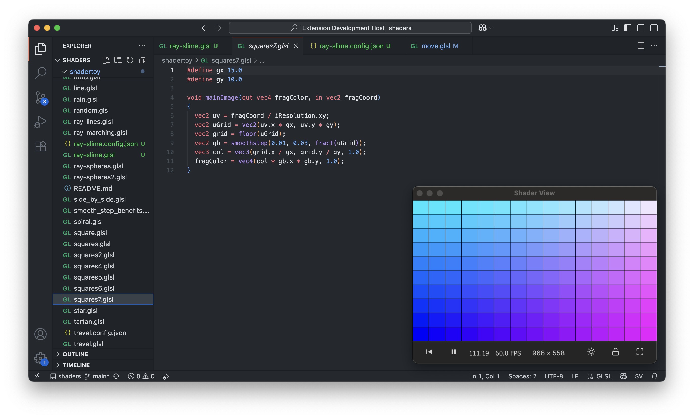

# shader-view

A fast shadertoy viewer for vscode with hot reloading.



## Project Structure

- `/extension/` - VS Code extension source code
- `/ui/` - Svelte-based UI for the shader viewer
- `/electron/` - Shader View window mode using Electron.

## Configuration

Add config same dir as shader like so: shadername.config.json

```json
{
  "Image": {
    "inputs": {
      "iChannel0": {
        "source": "BufferA",
        "type": "buffer"
      }
    }
  },
  "BufferA": {
    "path": "buffer_name.glsl",
    "inputs": {
      "iChannel0": {
        "source": "BufferA",
        "type": "buffer"
      },
      "iChannel1": {
        "type": "keyboard"
      }
    }
  }
}
```

Currently supports uniforms:
- `iTime` - shader playback time (in seconds)
- `iTimeDelta` - render time (time since last frame, in seconds)
- `iFrameRate` - shader frame rate (frames per second)
- `iFrame` - shader playback frame number
- `iMouse` - mouse pixel coordinates
- `iResolution` - viewport resolution (in pixels)
- `iChannel0-3` - input channels (textures, buffers, keyboard)
- `iDate` - current date (year, month, day, time in seconds)

## Not Yet Supported (from Shadertoy)

- `iChannelTime[4]` - channel playback time (for video inputs)
- `iChannelResolution[4]` - channel resolution for each input
- `samplerCube iChannelX` - cubemap texture support
- `iSampleRate` - sound sample rate (typically 44100)
- Video texture inputs
- Audio/sound inputs
- Webcam inputs
- Volume/microphone inputs
- VR/AR inputs
