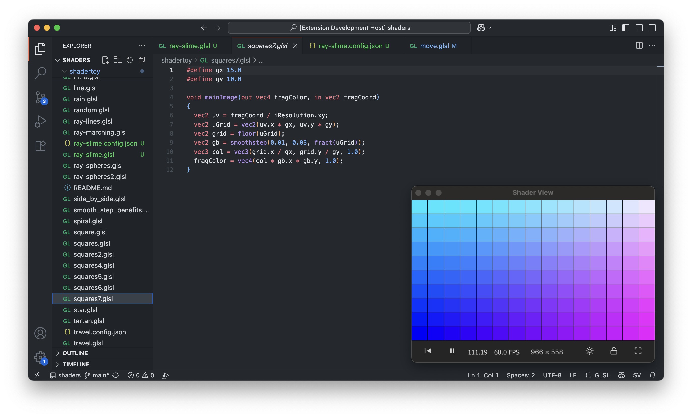

# shader-view

A fast shadertoy viewer for vscode with hot reloading.



## Project Structure

- `/extension/` - VS Code extension source code
- `/ui/` - Svelte-based UI for the shader viewer
- `/config-ui/` - Svelte-based UI for the shader configuration editor
- `/electron/` - Shader View window mode using Electron.

## Development

### Building the Extension

The extension has an integrated build process that automatically builds the
config-ui before compiling the extension:

```bash
# Build everything (config-ui + extension)
cd extension
npm run compile

# Watch mode for extension (also builds config-ui once)
npm run watch

# Separate config-ui development
npm run watch:config-ui
```

### VS Code Tasks

Use the VS Code command palette (`Cmd/Ctrl + Shift + P`) and run:

- `Tasks: Run Task` → `Build Extension with Config UI` - Full build
- `Tasks: Run Task` → `Build Config UI` - Just build the config editor
- `Tasks: Run Task` → `Watch Config UI` - Watch config editor for changes

## Configuration

### Shader Configuration Files

Add config same dir as shader like so: shadername.sv.json

The extension provides a visual editor for `.sv.json` files. When you open a
`.sv.json` file, VS Code will show a custom editor interface built with Svelte
that allows you to:

- Edit configuration visually
- Add/remove buffer passes
- Configure input channels
- Real-time JSON validation

### Configuration Format

```json
{
  "version": "1.0",
  "passes": {
    "Image": {
      "inputs": {
        "iChannel0": {
          "source": "BufferA",
          "type": "buffer"
        }
      }
    },
    "BufferA": {
      "path": "buffer_name.glsl",
      "inputs": {
        "iChannel0": {
          "source": "BufferA",
          "type": "buffer"
        },
        "iChannel1": {
          "type": "keyboard"
        }
      }
    }
  }
}
```

Currently supports uniforms:

- `iTime` - shader playback time (in seconds)
- `iTimeDelta` - render time (time since last frame, in seconds)
- `iFrameRate` - shader frame rate (frames per second)
- `iFrame` - shader playback frame number
- `iMouse` - mouse pixel coordinates
- `iResolution` - viewport resolution (in pixels)
- `iChannel0-3` - input channels (textures, buffers, keyboard)
- `iDate` - current date (year, month, day, time in seconds)

## Not Yet Supported (from Shadertoy)

- `iChannelTime[4]` - channel playback time (for video inputs)
- `iChannelResolution[4]` - channel resolution for each input
- `samplerCube iChannelX` - cubemap texture support
- `iSampleRate` - sound sample rate (typically 44100)
- Video texture inputs
- Audio/sound inputs
- Webcam inputs
- Volume/microphone inputs
- VR/AR inputs
