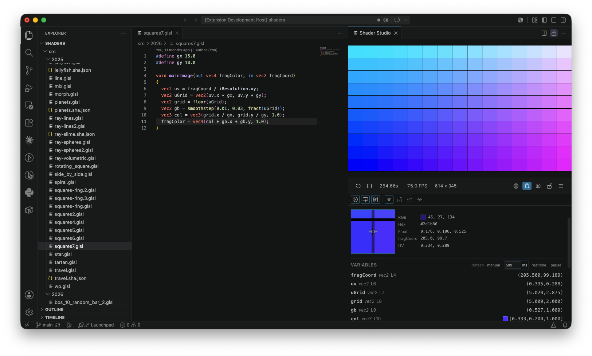
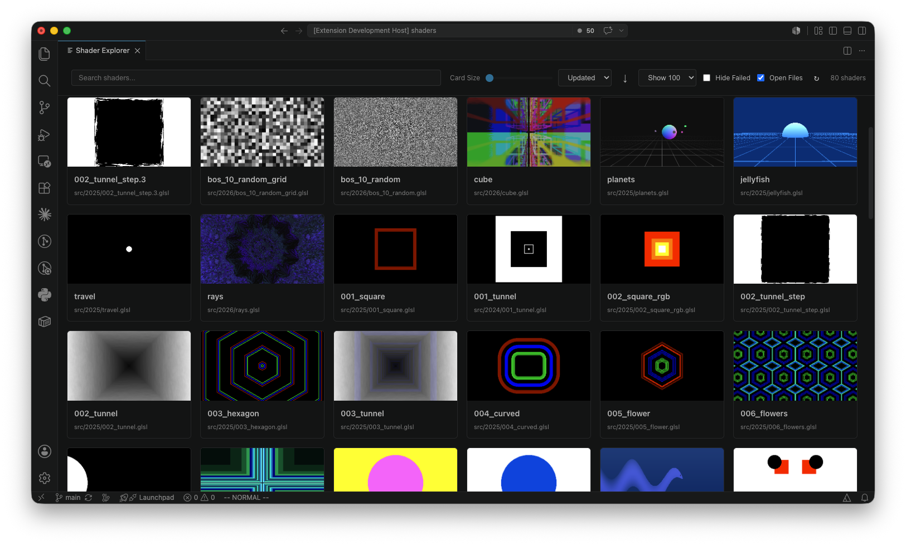

# Shader Studio

A GLSL fragment shader viewer for VS Code with hot reloading, designed specifically for Shadertoy-style shaders.




## Installation
Install through VS Code extensions. Search for "Shader Studio".

[Visual Studio Code Market Shader Studio](https://marketplace.visualstudio.com/items?itemName=teaqu.shader-studio)

Docs: https://teaqu.github.io/shader-studio/

## Project Structure

- `/extension/` - VS Code extension
- `/ui/` - User interface including shader rendering components
- `/config-ui/` - UI for editing json config

## Development

### Building the Extension

```bash
cd extension
npm run build
```

# Usage
See the Extension's [README](/extension/README.md).

## Docs

https://teaqu.github.io/shader-studio/

Docs are in `/docs` and configured with MkDocs (`/mkdocs.yml`).

- Local build: `mkdocs build`
- Local preview: `mkdocs serve`

GitHub Pages deployment workflow is at `.github/workflows/docs.yml`.
