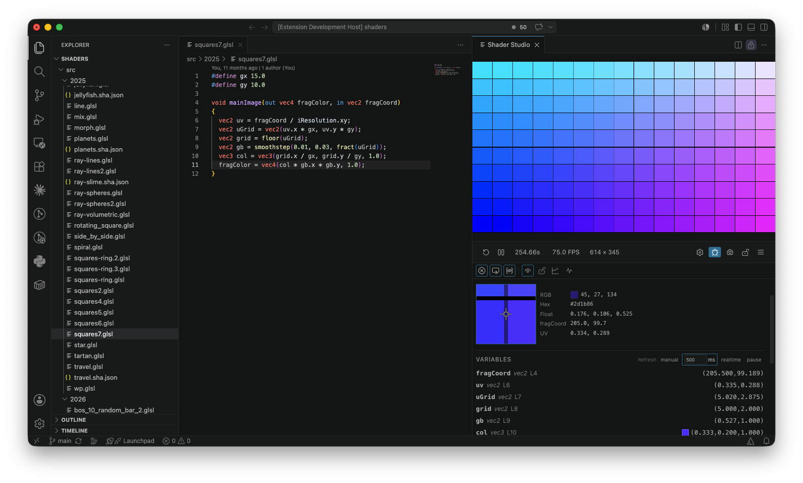
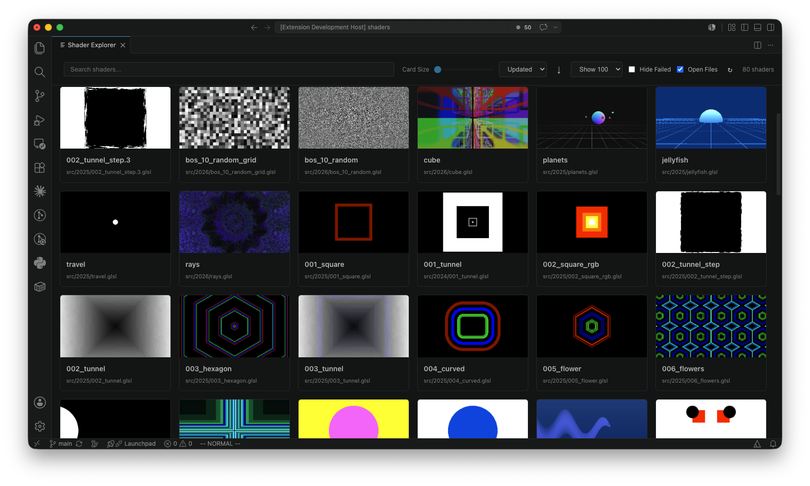

# Shader Studio

A GLSL and Slang shader viewer for VS Code with hot reloading. Edit Shadertoy-style GLSL fragment shaders or write Slang shaders for the WebGPU pipeline — both with live preview, multi-pass pipelines, and visual debugging.

Try Shader Studio in [Standalone web mode](https://teaqu.github.io/shader-studio/app/) in your browser.

### VSCode Marketplace
 https://marketplace.visualstudio.com/items?itemName=teaqu.shader-studio. 

### Documentation
https://teaqu.github.io/shader-studio/docs/




## Installation
Install through VS Code extensions. Search for "Shader Studio".

[Visual Studio Code Market Shader Studio](https://marketplace.visualstudio.com/items?itemName=teaqu.shader-studio)

## Development

### Building the Extension

This repository is an npm workspace managed with Turborepo. Run build commands
from the repository root unless a command says otherwise.

Prerequisites:

- Node.js 18 or newer
- npm 9 or newer

Install dependencies:

```bash
npm install
```

Build everything needed by the VS Code extension:

```bash
npm run build
```

That command builds the UI packages, copies their compiled assets into the
extension package, and then builds the extension host code.

Useful targeted builds:

```bash
npm run build:types
npm run build:ui
npm run build:shader-explorer
npm run build:extension
```

For extension packaging work, run the extension package script:

```bash
cd extension
npm run build
```

To create a `.vsix` package locally:

```bash
cd extension
npm run vsce-package
```

### Web Mode

Run the standalone web build locally:

```bash
cd ui
npm run dev:web
```

Build the static site (same output GitHub Pages deploys):

```bash
npm run build:web -w ui
```

## Docs

https://teaqu.github.io/shader-studio/docs/

Docs are in `/docs` and configured with MkDocs (`/mkdocs.yml`).

Install dependencies:

```bash
python3 -m venv .venv
source .venv/bin/activate
pip install -r docs/requirements.txt
```

- Local build: `mkdocs build`
- Local preview: `mkdocs serve`

GitHub Pages deployment workflow is at `.github/workflows/docs.yml`.
