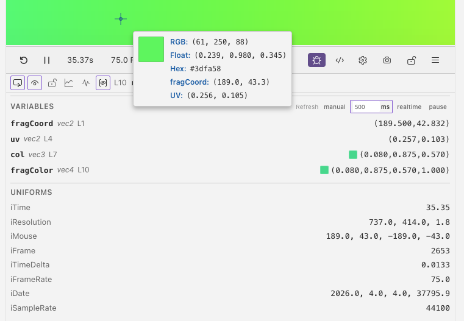

# Debug Mode

Debug mode is a panel that gives you tools to inspect and analyse your shader while it runs. Toggle it with the <i class="codicon codicon-bug"></i> button in the preview toolbar.

When enabled, the debug panel appears next to the canvas. Each feature inside can be turned on or off independently depending on what you need.

## Debug Panel Toolbar

The header has buttons to toggle individual features:

| Button | Description |
|--------|-------------|
| <i class="codicon codicon-inspect"></i> **Pixel Inspector** | Hover over the canvas to see RGB, float, hex, fragCoord, and UV values at the cursor position |
| <i class="codicon codicon-eye"></i> **Inline Rendering** | Visualize the value of the variable on your current line by rewriting the shader output ([more](inline-rendering.md)) |
| <i class="codicon codicon-lock"></i> / <i class="codicon codicon-unlock"></i> **Line Lock** | Freeze the debug view on the current line so moving the cursor elsewhere doesn't change it |
| <i class="codicon codicon-graph-line"></i> **Normalize** | Remap value ranges to make small variations visible ([more](normalization.md)) |
| <i class="codicon codicon-pulse"></i> **Step** | Apply a binary threshold to the output ([more](normalization.md#step-threshold)) |
| <i class="codicon codicon-symbol-variable"></i> **Variable Inspector** | Capture and inspect all variables in scope ([more](variable-inspector.md)) |

## Features

| Feature | What It Does | Page |
|---------|-------------|------|
| <i class="codicon codicon-inspect"></i> Pixel Inspector | See exact RGB, float, and coordinate values under your cursor | [Pixel Inspector](pixel-inspector.md) |
| <i class="codicon codicon-eye"></i> Inline Rendering | Execute only up to the current line and visualize the result | [Inline Rendering](inline-rendering.md) |
| <i class="codicon codicon-symbol-variable"></i> Variable Inspector | Capture all in-scope variable values by sampling across the canvas or at a single pixel | [Variable Inspector](variable-inspector.md) |
| <i class="codicon codicon-graph-line"></i> Normalization & Step | Remap value ranges and apply binary thresholds | [Normalization & Step](normalization.md) |
| <i class="codicon codicon-gear"></i> Parameters & Loops | Control function arguments and cap loop iterations | [Parameters & Loops](parameters-and-loops.md) |
| <i class="codicon codicon-code"></i> JavaScript Transpilation | Transpile GLSL to JavaScript for step-through debugging | [JavaScript Transpilation](../help/transpilation.md) |

## Uniforms

The uniforms section is always visible at the bottom of the debug panel. It shows live values of:

| Uniform | Description |
|---------|-------------|
| `iTime` | Elapsed time in seconds |
| `iResolution` | Viewport dimensions |
| `iMouse` | Mouse position (xy = current, zw = previous) |
| `iFrame` | Frame counter |
| `iTimeDelta` | Seconds since last frame |
| `iFrameRate` | Current frames per second |
| `iDate` | Year, month, day, seconds since midnight |

If the shader has [script-driven uniforms](../help/config-file.md#script-driven-uniforms), they appear below the standard uniforms with their current values.

## Next

[Pixel Inspector](pixel-inspector.md) — see exact RGB, float, and coordinate values under your cursor
