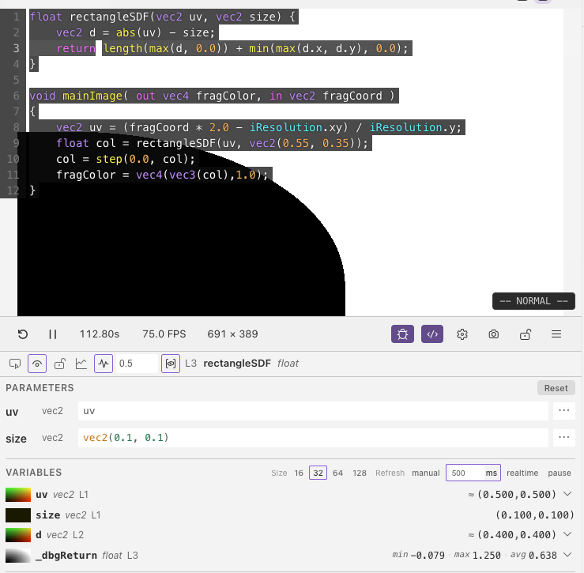
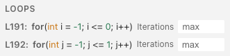

# Parameters & Loops

When debugging inside a helper function or a loop, extra controls appear in the debug panel to help you control execution.

## Parameters

When your cursor is inside a helper function (not `mainImage`), the Parameters section lets you choose what values are passed to the function's arguments.

Each parameter can be set to:

- **UV** — map the parameter to screen coordinates (default for spatial parameters)
- **Centered UV** — aspect-ratio-corrected coordinates centred on the screen
- **Custom** — enter your own constant value, with sliders, colour pickers, or number inputs depending on the type
- **Preset** — use built-in expressions like `iTime`, `sin(iTime)`, or `iFrame`

Parameter values are cleared when you switch to a different function.

## Loops

When your cursor is inside a loop, the Loops section lets you cap the number of iterations. This is useful when debugging expensive loops — like raymarching with hundreds of steps — so the shader stays responsive.

Set the max iterations to a low number (like 5–20) to see early behaviour, or leave it empty to let the loop run fully. Each loop in a nested set can be capped independently.

## Next

[Normalization & Step](normalization.md) — remap value ranges and apply binary thresholds
