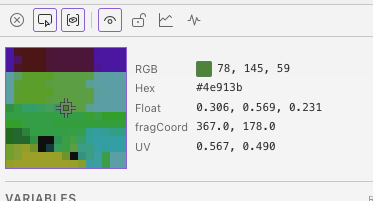

# Pixel Inspector

The pixel inspector shows the exact values under your cursor as you hover over the shader preview. It displays RGB, float values, hex codes, fragCoord, and UV coordinates in real time.

## Enabling

Toggle the pixel inspector with the <i class="codicon codicon-inspect"></i> button in the debug panel header.

## Loupe

The loupe is optional and can be toggled with the zoom-in button in the debug panel header. The pixel inspector must be enabled before the loupe control is available.

When enabled, it shows a 120px circular view around the cursor at 8x magnification with crisp pixels, a center pixel highlight, and a crosshair. It uses the existing preview canvas, so it does not add extra GPU readback.

## Using

- **Hover** over the preview canvas to see values at that pixel
- **Click** to lock the inspector to a specific position so the values stay visible while you move the cursor elsewhere
- **Click again** to unlock and resume following the cursor

The inspector updates in real time as the shader animates, so you can watch how values change at a fixed point.

## Next

[Inline Rendering](inline-rendering.md) — visualize any variable line-by-line as color output
