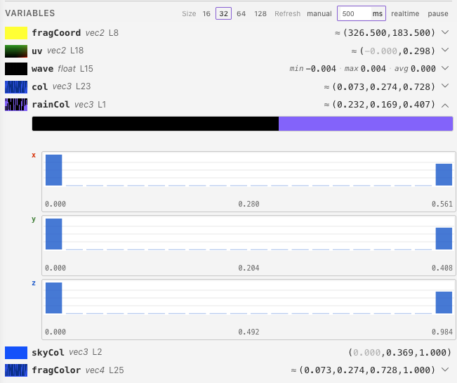
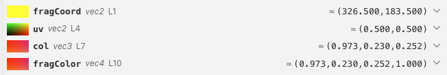
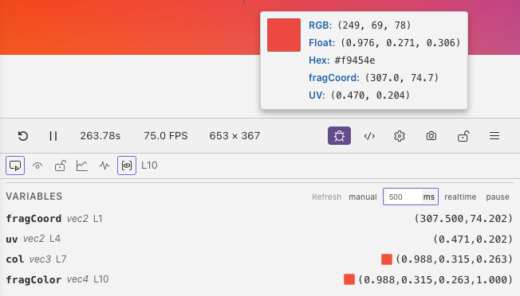
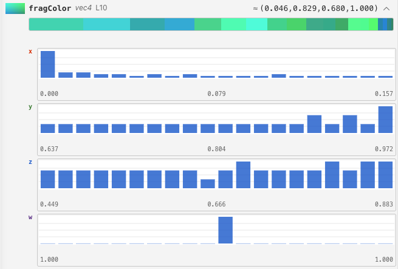

# Variable Inspector

The variable inspector captures the values of **all in-scope variables** at the current debug line and displays them in the debug panel. It supports two capture modes: **sampling** (across the canvas) and **pixel mode** (a single pixel under the cursor).

## Enabling

Toggle the variable inspector with the <i class="codicon codicon-symbol-variable"></i> button in the debug panel header. When enabled, a Variables section appears in the debug panel showing every captured variable. The enabled state persists across sessions.

## Captured Variables

The inspector automatically finds all variables in scope at the current debug line. This includes:

- Variables declared before the debug line in the current function
- Function parameters
- Variables from enclosing scopes (e.g. outer blocks)

For Slang and WGSL, the inspector shows function parameters and local variables.
Use the Uniforms section for built-ins and the config panel's Script tab for
script values.

### Supported Types

| Value | Display |
|-------|---------|
| Scalar (`float`, `int`, `bool`) | A single value; booleans appear as 0 or 1 |
| Vector (`vec2`, `vec3`, `vec4`) | Each component's value |
| 2×2 matrix (`mat2`) | Four values in column order |

Slang and WGSL support their equivalent scalar, vector, and 2×2 matrix types.
See [Language Support](../features/language-support.md) for details.
For larger matrices, arrays, or structs, select a supported component or field.
Samplers and `out`/`inout` parameters are not shown. Up to **15 variables** can
be captured on a line.

### Whole-Shader Mode

When no specific debug line is selected, the inspector captures variables at the last line of `mainImage`, giving you a snapshot of the final state of all local variables.

## Capture Modes

### Sampling

Samples the variable across a grid of points spanning the full canvas. Each grid cell samples the shader at the corresponding screen position.

**Grid sizes:**

| Size | Total Samples | Speed | Detail |
|------|---------------|-------|--------|
| 16x16 | 256 | Fast | Low spatial resolution |
| **32x32** | 1,024 | Balanced | Default, good for most cases |
| 64x64 | 4,096 | Slower | High spatial detail |
| 128x128 | 16,384 | Slowest | Maximum detail |

The size buttons appear in the Variables section header. The active size is highlighted.

The sampling grid cannot exceed the current preview resolution. For example, a
`1 × 1` preview provides just one sample.

### Pixel Mode

Captures variable values at a **single pixel** under the cursor. The [pixel inspector](pixel-inspector.md) needs to be enabled so you can click to lock a specific pixel position.

## Refresh Modes

Control how often captures are updated. The refresh mode buttons appear in the Variables section header.

| Mode | Behavior | Use Case |
|------|----------|----------|
| **Manual** | Recapture only when state changes (cursor move, shader edit) | Stable analysis, lowest performance impact |
| **Polling** | Recapture every N milliseconds | Monitoring animated values at controlled cost |
| **Realtime** | Recapture every frame (~60Hz) | Watching live animations, highest performance impact |
| **Pause** | Freeze captured values, no new captures | Inspecting a snapshot without changes |

### Polling Interval

When in polling mode, a number input appears to set the interval in milliseconds. Default is **500ms**.

## Expanded Details

Click the expand button on a varying variable (sampling mode) to see detailed statistics and visualizations.

### Scalar Variables (float, int, bool)

Expanded view shows a **greyscale frequency bar** and a **histogram** of the
sampled values. Taller bars mean more samples in that range. Hover over a bar
for its range, count, and percentage. A dashed marker highlights zero when the
values include both negative and positive numbers.

### Vector Variables (vec2, vec3, vec4)

The **color frequency bar** shows the most common colors. Hover over a segment
for its color values and percentage. **Per-channel histograms** show how each
component varies, using matching scales so you can compare them.

## Tips

- Use **manual** refresh mode when you don't need continuous updates
- Start with **32x32** grid and increase only if you need more spatial detail
- Expand a variable to see its value distribution
- Use **pixel mode** when you only care about values at a specific point
- Use **pause** to freeze captures while you analyze results
- If captures look unexpectedly coarse or oversized, check the live resolution shown in the toolbar, because the inspector follows that effective render size exactly
