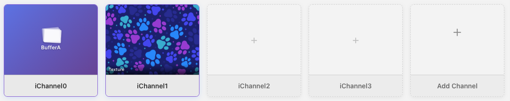
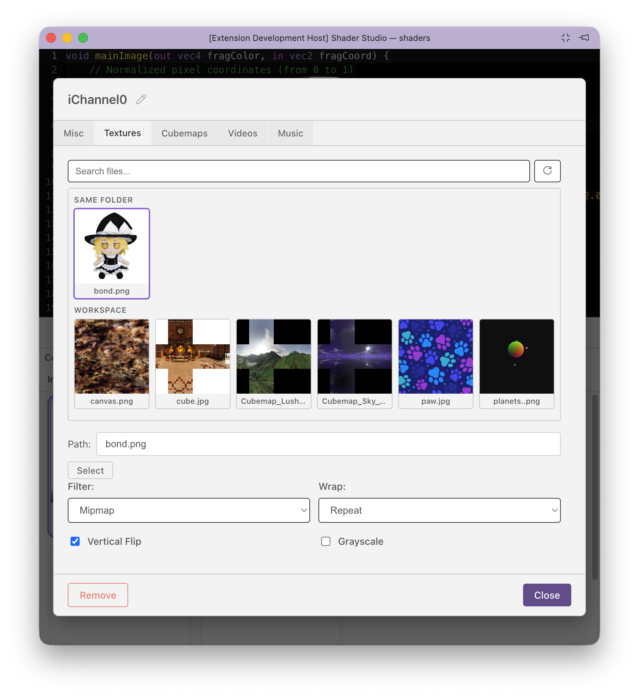
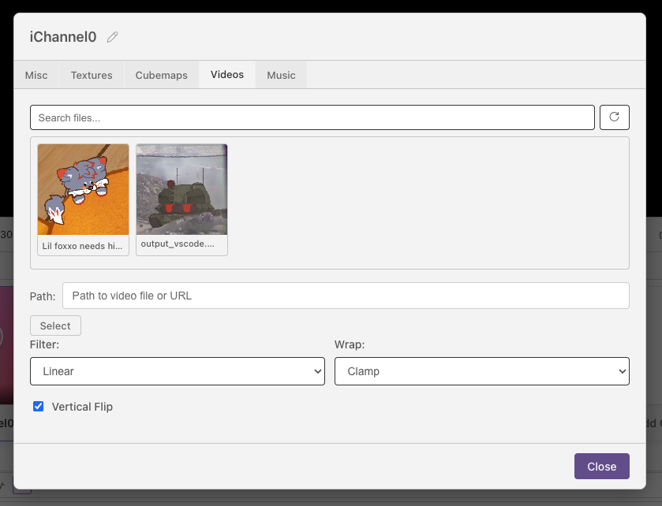
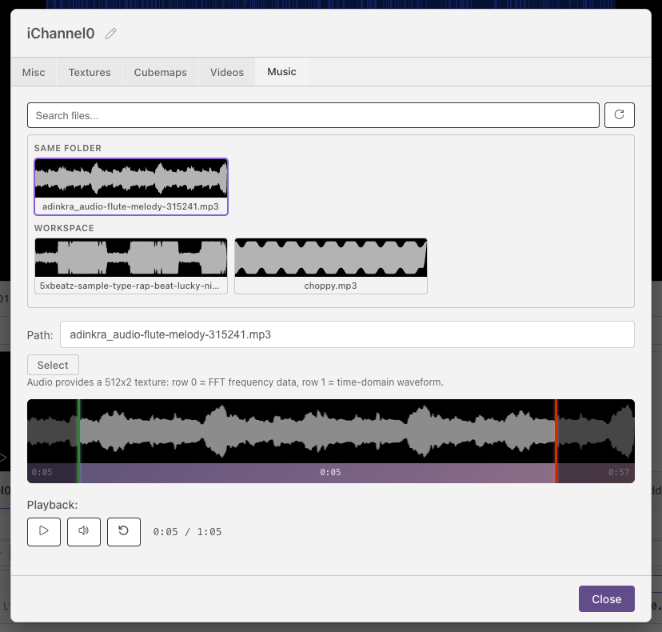
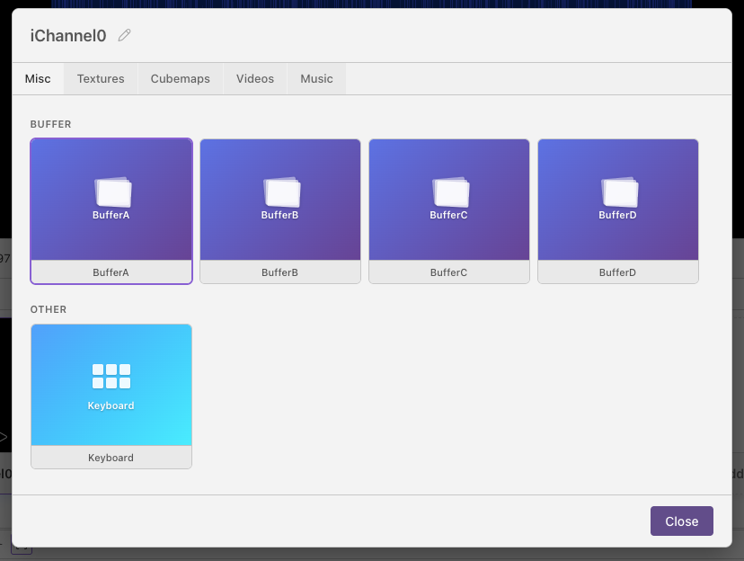

# Channels



Channels are how a shader pass reads anything outside its own code: images, video, audio, other buffers, cubemaps, or keyboard state. In GLSL, those inputs appear as uniforms such as `iChannel0`, `iChannel1`, and so on.

Each pass has its own channel grid with up to 16 slots, from `iChannel0` to `iChannel15`. The Image pass can have channels, and every Buffer pass can have a separate set of channels. That means `iChannel0` in Image can point to BufferA, while `iChannel0` in BufferA can point to a noise texture.

## What Channels Can Do

Channels are useful in a few different ways:

- Add source media, such as images, videos, audio files, and cubemaps.
- Connect passes together by reading the output of a buffer.
- Build feedback effects by letting a buffer read its own previous frame.
- Make shaders interactive by sampling keyboard state.
- Use per-input metadata such as resolution and playback time.

## Adding a Channel

Open the pass you want to configure, then use the channel grid:

1. Click **+** on an empty slot to add an input.
2. Choose what the channel should read: texture, video, audio, cubemap, buffer, or keyboard.
3. Set the file, source pass, or options for that input.
4. Sample it in GLSL with the matching channel name.

Click an existing channel to edit or remove it. Channels can also be renamed, as long as the name is a valid GLSL identifier.

!!! note
    Shader Studio injects channel uniforms automatically. For most channel types, you do not need to declare `uniform sampler2D iChannelN;` in your shader.

## Sampling Channels in GLSL

The channel slot tells you which uniform to sample. If you add a texture to `iChannel0`, sample `iChannel0`. If you add keyboard state to `iChannel1`, sample `iChannel1`.

```glsl
vec2 uv = fragCoord / iResolution.xy;
vec4 inputColor = texture(iChannel0, uv);
```

Use `iChannelResolution[N].xy` when the input has a different size than the canvas:

```glsl
vec2 inputUV = fragCoord / iChannelResolution[0].xy;
vec4 inputColor = texture(iChannel0, inputUV);
```

## Choosing a Channel Type

Use a channel type based on what the shader needs to sample:

| Type | Use it for | GLSL sampler |
|------|------------|--------------|
| **Texture** | Static images, noise maps, lookup tables, masks | `sampler2D` |
| **Video** | Moving footage sampled like an image | `sampler2D` |
| **Audio** | FFT and waveform data from an audio file | `sampler2D` |
| **Cubemap** | Skyboxes and environment maps | `samplerCube` sampled with a `vec3` direction |
| **Buffer** | Output from another pass, including feedback | `sampler2D` |
| **Keyboard** | Pressed, held, and toggled key state | `sampler2D` |

Every channel also gets metadata uniforms such as `iChannelResolution[N]`, and time-based inputs update `iChannelTime[N]`.

## Texture Channels

Bind a static image file to a channel.



**Supported formats:** `png jpg jpeg gif bmp webp tga hdr exr`

| Option | Values | Default | Description |
|--------|--------|---------|-------------|
| `filter` | `mipmap` / `linear` / `nearest` | `mipmap` | Texture filtering quality |
| `wrap` | `repeat` / `clamp` | `clamp` | Edge sampling behaviour |
| `vflip` | bool | `false` | Flip the image vertically |
| `grayscale` | bool | `false` | Convert to luminance (single channel) |

```glsl
vec4 col = texture(iChannel0, uv * 4.0);  // tiling works because wrap = repeat
```

!!! tip
    Use `filter: nearest` and `wrap: repeat` for data textures or pixel-art where blending between texels is undesirable.

## Video Channels

Bind a video file. Sampled identically to a texture in GLSL.



**Supported formats:** `mp4 webm ogg mov`

The channel editor includes playback controls — play, pause, next, mute, reset, and a time display. Playback is synced to the shader's play/pause state.

!!! note
    Pausing the shader pauses the video.

## Audio Channels

Bind an audio file. The channel provides a **512×2 texture** containing frequency and waveform data each frame.



**Supported formats:** `mp3 wav ogg flac aac m4a`

**Texture layout:**

| Row | y coordinate | Contents |
|-----|-------------|----------|
| Row 0 | ≈ 0.25 | FFT frequency spectrum — x goes from low to high frequency, value is amplitude 0–1 |
| Row 1 | ≈ 0.75 | Time-domain waveform — x is sample position across the current audio frame |

```glsl
float bass   = texture(iChannel0, vec2(0.05, 0.25)).r; // (1)
float treble = texture(iChannel0, vec2(0.85, 0.25)).r; // (2)
float wave   = texture(iChannel0, vec2(uv.x, 0.75)).r; // (3)
```

1. Low-frequency FFT bin (x ≈ 0 = bass)
2. High-frequency FFT bin (x ≈ 1 = treble)
3. Waveform value at the current screen column

The channel editor includes a **waveform visualiser** with draggable handles to set a loop region (`startTime` / `endTime` in seconds) and standard playback controls.

!!! tip
    The FFT texture layout matches Shadertoy's audio format exactly — audio-reactive shaders from Shadertoy port directly.

## Cubemap Channels

Bind a cubemap image for environment mapping or skyboxes. The image must be in **cross layout** (T-cross PNG), which is the same format Shadertoy uses.

For free cubemap textures, see [Humus 3D](https://www.humus.name/index.php?page=Textures).

**Supported formats:** `png jpg jpeg hdr exr`

| Option | Values | Default |
|--------|--------|---------|
| `filter` | `mipmap` / `linear` / `nearest` | `mipmap` |
| `wrap` | `clamp` / `repeat` | `clamp` |
| `vflip` | bool | `false` | |

Unlike other channel types, a cubemap channel is bound as `samplerCube` — you must sample it with a 3D direction vector.

```glsl
vec3 dir = normalize(reflect(rayDir, normal));
vec4 sky  = texture(iChannel0, dir);  // samplerCube lookup — direction, not UV
```

!!! warning
    Cubemap channels are `samplerCube`, not `sampler2D`. Passing a `vec2` UV will cause a compile error.

## Buffer Channels

Read the output of another pass as a texture. The `source` field names the pass to read from.



```glsl
vec2 bufferUV = fragCoord / iChannelResolution[0].xy;  // use buffer's own resolution
vec4 prev = texture(iChannel0, bufferUV);
```

!!! note
    Use `iChannelResolution[N].xy` to get the buffer's resolution for UV mapping, especially if the buffer has a fixed resolution different from the canvas.

**Self-reference (feedback):** A buffer can list itself as a source. Each frame it reads its own *previous* output. This enables feedback loops, particle trails, and simulations.


## Keyboard Channels

Bind keyboard state as a texture. No path or options — just add it to a channel slot.

The channel provides a **256×3 texture**. Each column is a key code (matching browser `e.keyCode` values, the same as Shadertoy).

| Row | y coordinate | Contents |
|-----|-------------|----------|
| Row 0 | ≈ 0.16 | Key currently held (255 = held, 0 = not held) |
| Row 1 | ≈ 0.50 | Key was just pressed this frame |
| Row 2 | ≈ 0.83 | Toggle — alternates each press |

```glsl
// iChannel1 = keyboard
float held    = texture(iChannel1, vec2(32.0 / 256.0, 0.16)).r;  // Space held
float pressed = texture(iChannel1, vec2(32.0 / 256.0, 0.50)).r;  // Space just pressed
```

## Next

[Time and Playback Controls](time-controls.md) — scrub, loop, and control playback speed
