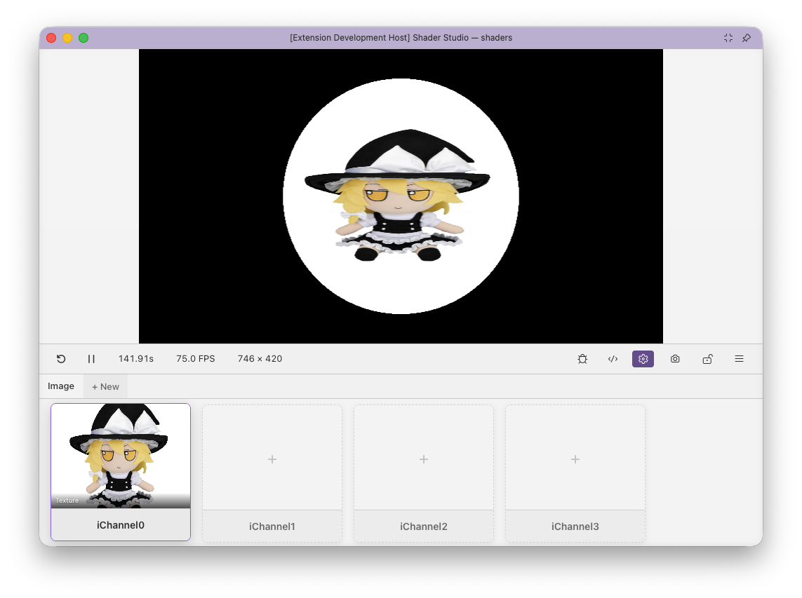
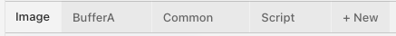

# Configure Buffers and Inputs

The config panel is where you set up multi-pass pipelines and bind assets to shader inputs. Everything is stored in a `.sha.json` file that the visual editor writes for you.

## Opening the Config Panel

Click the <i class="codicon codicon-gear"></i> **Config** button in the toolbar.



---

## The Pass Tab Bar

The tab bar at the top shows every pass in your shader. Click **+ New** to add a pass. Remove a pass with the `×` on its tab (Image cannot be removed).



| Tab | Description |
|-----|-------------|
| **Image** | Always present. The final rendered output. No file path — this is your `mainImage` shader. |
| **BufferA / B / C / D** | Intermediate render passes, each backed by a separate `.glsl` file. |
| **Common** | Shared GLSL included verbatim at the top of every pass. Not a render pass — has no framebuffer. |
| **Script** | A TypeScript or JavaScript file that drives custom `uniform` values per frame. |

!!! note
    When editing buffer files, use the <i class="codicon codicon-lock"></i> **Lock** button to keep the preview pinned to your Image pass. See [Locking](locking.md).

---

## The Image Pass

The Image tab has no file path — it always corresponds to your main shader file. By default it fills the panel. You can optionally save a resolution to the config:

| Setting | Options | Description |
|---------|---------|-------------|
| **Scale** | 0.25×, 0.5×, 1×, 2×, 4× | Relative to the panel size |
| **Aspect ratio** | 16:9, 4:3, 1:1, Fill, Auto | Constrains the canvas shape |
| **Custom dimensions** | e.g. `1920 × 1080` | Base width and height in pixels |

These settings are the persistent default for this shader.

- These controls define the shader's **Config Resolution**.
- The [Resolution](resolution.md) toolbar button can override them with a **Session Resolution** for the current session.
- Editing the Image pass resolution in the config panel updates the live preview immediately.
- The toolbar resolution popup updates immediately to match the new **Session Resolution** derived from that config change.
- If debug mode is enabled, inline rendering and the variable inspector also refresh immediately from the new **Live Render Resolution**.
- `scale` and `customWidth` / `customHeight` are composable. For example, `customWidth: 320`, `customHeight: 180`, `scale: 2` renders as `640 × 360`.

Switching to a different shader resets the Session Resolution back to whatever that shader's Config Resolution specifies.

---

## Buffer Passes

Each buffer pass renders a `.glsl` file to an offscreen framebuffer that other passes can read as a texture.

**Path field** — points to the GLSL file for this buffer. Three path forms are supported:

| Form | Example | Resolves relative to |
|------|---------|----------------------|
| Relative | `shader.bufferA.glsl` | The main shader file |
| Absolute | `/Users/me/project/bufferA.glsl` | Filesystem root |
| Workspace-root | `@/src/bufferA.glsl` | VS Code workspace root |

If the file doesn't exist yet, the editor shows a **Create File** button that generates it with a `mainImage` stub.

**Resolution** (optional) — by default a buffer inherits the Image pass resolution exactly. You can override this in two ways:

| Mode | Example | Description |
|------|---------|-------------|
| **Fixed** | `512 × 512` | Exact pixel dimensions, independent of the canvas |
| **Scale** | `0.5×` | Multiplier on the Image resolution — tracks canvas changes |

Use fixed for simulation grids or lookup tables that need a predictable exact size. Use scale for blur/downsample passes that should stay proportional to the output — e.g. `0.5×` always renders at half the Image resolution regardless of canvas size.

!!! tip
    Keep buffer files in the same directory as your main shader and use relative paths. Absolute paths work but break if you move or share the project.

---

## Channels — Overview

Each pass has up to 16 input channels (`iChannel0`–`iChannel15`), displayed as a grid. Click **+** on an empty slot to add one. Click an existing channel to edit or remove it.

!!! note
    Shader Studio injects the `uniform sampler2D iChannelN;` declarations automatically. You do not need to declare them in your shader.

Channels can be renamed (the name must be a valid GLSL identifier). A **Sort A–Z** button appears when multiple channels are configured.

---

## Channel Type: Texture

Bind a static image file to a channel.

**Supported formats:** `png jpg jpeg gif bmp webp tga hdr exr`

| Option | Values | Default | Description |
|--------|--------|---------|-------------|
| `filter` | `mipmap` / `linear` / `nearest` | `mipmap` | Texture filtering quality |
| `wrap` | `repeat` / `clamp` | `clamp` | Edge sampling behaviour |
| `vflip` | bool | `false` | Flip the image vertically |
| `grayscale` | bool | `false` | Convert to luminance (single channel) |

```json
"iChannel0": {
  "type": "texture",
  "path": "textures/noise.png",
  "filter": "nearest",
  "wrap": "repeat"
}
```

```glsl
vec4 col = texture(iChannel0, uv * 4.0);  // tiling works because wrap = repeat
```

!!! tip
    Use `filter: nearest` and `wrap: repeat` for data textures or pixel-art where blending between texels is undesirable.

---

## Channel Type: Video

Bind a video file. Sampled identically to a texture in GLSL.

**Supported formats:** `mp4 webm ogg mov`

Options are the same as texture (`filter`, `wrap`, `vflip`) except `grayscale` is not available.

The channel editor includes playback controls — play, pause, mute, reset, and a time display. Playback is synced to the shader's play/pause state.

!!! note
    Pausing the shader pauses the video.

```json
"iChannel0": {
  "type": "video",
  "path": "footage/timelapse.mp4",
  "filter": "linear",
  "wrap": "clamp",
  "vflip": true
}
```

---

## Channel Type: Audio

Bind an audio file. The channel provides a **512×2 texture** containing frequency and waveform data each frame.

**Supported formats:** `mp3 wav ogg flac aac m4a`

**Texture layout:**

| Row | y coordinate | Contents |
|-----|-------------|----------|
| Row 0 | ≈ 0.25 | FFT frequency spectrum — x goes from low to high frequency, value is amplitude 0–1 |
| Row 1 | ≈ 0.75 | Time-domain waveform — x is sample position across the current audio frame |

```json
"iChannel0": {
  "type": "audio",
  "path": "music/track.mp3",
  "startTime": 8.0,
  "endTime": 32.0
}
```

```glsl
float bass   = texture(iChannel0, vec2(0.05, 0.25)).r; // (1)
float treble = texture(iChannel0, vec2(0.85, 0.25)).r; // (2)
float wave   = texture(iChannel0, vec2(uv.x, 0.75)).r; // (3)
```

1. Low-frequency FFT bin (x ≈ 0 = bass)
2. High-frequency FFT bin (x ≈ 1 = treble)
3. Waveform value at the current screen column

The channel editor includes a **waveform visualiser** with draggable handles to set a loop region (`startTime` / `endTime` in seconds) and standard playback controls.

!!! tip
    The FFT texture layout matches Shadertoy's audio format exactly — audio-reactive shaders from Shadertoy port directly.

---

## Channel Type: Cubemap

Bind a cubemap image for environment mapping or skyboxes. The image must be in **cross layout** (T-cross PNG), which is the same format Shadertoy uses.

**Supported formats:** `png jpg jpeg hdr exr`

| Option | Values | Default |
|--------|--------|---------|
| `filter` | `mipmap` / `linear` / `nearest` | `mipmap` |
| `wrap` | `clamp` / `repeat` | `clamp` |
| `vflip` | bool | `false` | |

Unlike other channel types, a cubemap channel is bound as `samplerCube` — you must sample it with a 3D direction vector.

```json
"iChannel0": {
  "type": "cubemap",
  "path": "textures/sky.png",
  "filter": "mipmap"
}
```

```glsl
vec3 dir = normalize(reflect(rayDir, normal));
vec4 sky  = texture(iChannel0, dir);  // samplerCube lookup — direction, not UV
```

!!! warning
    Cubemap channels are `samplerCube`, not `sampler2D`. Passing a `vec2` UV will cause a compile error.

---

## Channel Type: Buffer

Read the output of another pass as a texture. The `source` field names the pass to read from.

```json
"iChannel0": { "type": "buffer", "source": "BufferA" }
```

```glsl
vec2 bufferUV = fragCoord / iChannelResolution[0].xy;  // use buffer's own resolution
vec4 prev = texture(iChannel0, bufferUV);
```

!!! note
    Use `iChannelResolution[N].xy` to get the buffer's resolution for UV mapping, especially if the buffer has a fixed resolution different from the canvas.

**Self-reference (feedback):** A buffer can list itself as a source. Each frame it reads its own *previous* output. This enables feedback loops, particle trails, and simulations.

!!! warning
    On the very first frame, the previous buffer is initialised to black (all zeros). If your feedback shader blends unconditionally, the first frame will show a black flash. Use `iFrame == 0` to skip the blend on frame zero.

---

## Channel Type: Keyboard

Bind keyboard state as a texture. No path or options — just add it to a channel slot.

The channel provides a **256×3 texture**. Each column is a key code (matching browser `e.keyCode` values, the same as Shadertoy).

| Row | y coordinate | Contents |
|-----|-------------|----------|
| Row 0 | ≈ 0.16 | Key currently held (255 = held, 0 = not held) |
| Row 1 | ≈ 0.50 | Key was just pressed this frame |
| Row 2 | ≈ 0.83 | Toggle — alternates each press |

```glsl
// iChannel1 = keyboard
float held    = texture(iChannel1, vec2(32.0 / 256.0, 0.16)).r;  // Space held
float pressed = texture(iChannel1, vec2(32.0 / 256.0, 0.50)).r;  // Space just pressed
```

---

## The Script Pass

The Script pass drives custom `uniform` values per frame from a TypeScript or JavaScript file. It has no framebuffer — it only produces uniform data.

### Exporting Uniforms

Your script must export a `uniforms(ctx)` function that returns an object:

```typescript
// shader.uniforms.ts
export function uniforms(ctx: {
  iTime: number;
  iFrame: number;
  iTimeDelta: number;
  iFrameRate: number;
  iResolution: [number, number, number];
  iMouse: [number, number, number, number];
  iDate: [number, number, number, number];
  iSampleRate: number;
  iChannelTime: [number, number, number, number];
}) {
  return {
    uSpeed:   ctx.iTime * 0.5,
    uColor:   [Math.sin(ctx.iTime), 0.5, 1.0] as [number, number, number],
    uEnabled: true,
  };
}
```

### Type Inference

Types are inferred from the return value on the first call. The returned values are **injected as GLSL uniforms automatically** — no declaration needed in your shader.

| Return type | GLSL uniform |
|-------------|-------------|
| `number` | `uniform float uSpeed;` |
| `[n, n]` | `uniform vec2 uOffset;` |
| `[n, n, n]` | `uniform vec3 uColor;` |
| `[n, n, n, n]` | `uniform vec4 uRect;` |
| `boolean` | `uniform bool uEnabled;` |

### Polling Rate

The **Max Polling Rate** slider (1–120 fps) controls how often the script runs. The config panel shows the actual vs. target polling rate for each uniform.

For slowly-changing values, 1–10 fps is usually enough. High rates consume more CPU.

### Using Node.js APIs

Scripts run in Node.js and can `require()` any module. Modules resolve from the script file's own directory.

```typescript
import * as fs from 'fs';

export function uniforms(ctx) {
  const data = JSON.parse(fs.readFileSync('./params.json', 'utf8'));
  return { uValue: data.value };
}
```

!!! warning
    Do not name script uniforms the same as built-ins (`iTime`, `iResolution`, `iChannel0`, etc.). The script will fail to load with an error listing the collision.

---

## The Common Pass

The Common pass points to a `.glsl` file whose contents are prepended verbatim to every other pass before compilation. Use it for shared utility functions, constants, and type definitions.

```json
"Common": { "path": "shader.common.glsl" }
```

```glsl
// shader.common.glsl — available in Image, BufferA, etc.
float hash(vec2 p) { return fract(sin(dot(p, vec2(127.1, 311.7))) * 43758.5453); }
```

!!! note
    Common is not rendered — it has no framebuffer. It is purely a code injection, equivalent to a `#include`.

---

## Multi-Pass Patterns

??? "Post-Processing (Image reads BufferA)"

    BufferA renders the main scene. Image reads it and applies a full-screen effect.

    ```json
    {
      "BufferA": {
        "path": "shader.bufferA.glsl"
      },
      "Image": {
        "inputs": {
          "iChannel0": { "type": "buffer", "source": "BufferA" }
        }
      }
    }
    ```

    ```glsl
    // Image pass
    vec2 uv = fragCoord / iChannelResolution[0].xy;
    vec4 scene = texture(iChannel0, uv);
    // apply vignette, blur, colour grade, etc.
    ```

??? "Feedback / Trails (BufferA self-reads)"

    BufferA reads its own previous frame as `iChannel0` to accumulate history. Each frame blends new content with the accumulated buffer.

    ```json
    {
      "BufferA": {
        "path": "shader.bufferA.glsl",
        "inputs": {
          "iChannel0": { "type": "buffer", "source": "BufferA" }
        }
      }
    }
    ```

    ```glsl
    // BufferA pass
    vec2 uv   = fragCoord / iResolution.xy;
    vec4 prev = texture(iChannel0, uv);
    vec4 new  = vec4(someEffect(uv), 1.0);
    fragColor = mix(prev, new, 0.05);  // blend 5% new each frame
    ```

    !!! warning
        On frame zero the previous buffer is black. Use `if (iFrame == 0) { fragColor = new; return; }` to skip the blend on the first frame.

??? "Multi-Pass Pipeline (A → B → Image)"

    BufferA computes one thing, BufferB reads BufferA and refines it, Image composites the result.

    ```json
    {
      "BufferA": { "path": "shader.bufferA.glsl" },
      "BufferB": {
        "path": "shader.bufferB.glsl",
        "inputs": {
          "iChannel0": { "type": "buffer", "source": "BufferA" }
        }
      },
      "Image": {
        "inputs": {
          "iChannel0": { "type": "buffer", "source": "BufferB" }
        }
      }
    }
    ```

??? "Audio Reactive"

    Bind an audio file and sample the FFT row for bass/mid/treble to drive visual parameters.

    ```json
    {
      "Image": {
        "inputs": {
          "iChannel0": {
            "type": "audio",
            "path": "music/track.mp3",
            "startTime": 16.0,
            "endTime": 48.0
          }
        }
      }
    }
    ```

    ```glsl
    float bass   = texture(iChannel0, vec2(0.05, 0.25)).r;
    float mid    = texture(iChannel0, vec2(0.35, 0.25)).r;
    float treble = texture(iChannel0, vec2(0.75, 0.25)).r;

    float scale = 0.5 + bass * 1.5;
    vec3  col   = mix(vec3(0.1, 0.0, 0.5), vec3(1.0, 0.4, 0.0), mid);
    ```

??? "Shared Utilities with Common"

    Put noise, hash, and SDF functions in Common so every pass can call them without duplication.

    ```json
    {
      "Common": { "path": "shader.common.glsl" },
      "BufferA": { "path": "shader.bufferA.glsl" },
      "Image": { "path": "" }
    }
    ```

    ```glsl
    // shader.common.glsl
    float fbm(vec2 p) { /* ... */ }

    // shader.bufferA.glsl — fbm() is available here
    fragColor = vec4(fbm(uv * 3.0));

    // Image pass — fbm() is also available here
    float n = fbm(uv + iTime * 0.1);
    ```

---

## Other: Editing the Config File Directly

The config is stored as JSON in a `.sha.json` file with the same base name as the shader (`myshader.glsl` → `myshader.sha.json`), in the same directory. You can edit it directly in VS Code — the visual editor and the raw file stay in sync.

!!! tip
    The config panel has a toggle to switch between the visual editor and raw JSON view.

See [Config File Format](../help/config-file.md) for the full schema reference.

## Next

- [Config File Format](../help/config-file.md) — complete JSON schema reference
- [Shadertoy Compatibility](../help/shadertoy-compatibility.md) — porting multi-pass shaders from Shadertoy
- [Locking](locking.md) — keep the preview pinned while editing buffer files
