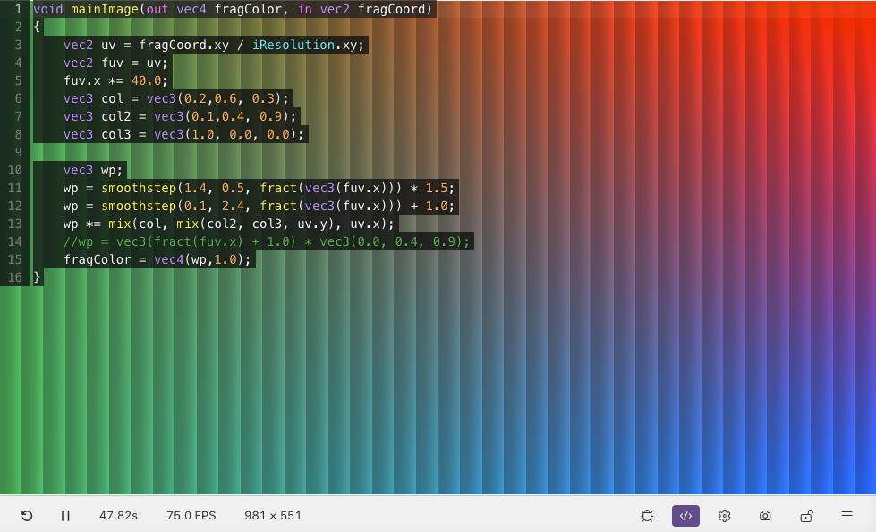

# Editor Overlay

The editor overlay lets you write shader code directly on top of the preview canvas. You see the shader output behind the code as you type, so you don't have to switch back and forth between the editor and the preview.

The overlay includes editor features designed to feel similar to the VS Code editor. Due to VS Code limitations, a custom embedded editor is used instead of the native one.

## Current Limitations

Search inside the editor overlay is not currently supported (except in vim mode). To search shader text while using Shader Studio, open the shader in the VS Code editor or open Shader Studio in a browser and use the browser's page search.

| Key | Action |
|-----|--------|
| `]d` | Jump to next diagnostic/error |
| `[d` | Jump to previous diagnostic/error |
| `gl` | Show the hover or diagnostic at the cursor |

(These commands not workign atm working but will fix eventually)

## Opening

- Click the <i class="codicon codicon-code"></i> **Editor** icon in the toolbar
- Or run **Shader Studio: Toggle Editor Overlay** from the command palette

## Working with Multiple Passes

When your shader has multiple passes — Image, BufferA, BufferB, Common, and so on — each appears as a tab along the top of the overlay. Click a tab to switch to that pass. Changes you make are saved back to the file automatically.

**Double-click** a tab to open that file in the VS Code editor. Use [locked mode](locking.md) to keep the preview pinned while you do this.

## Vim Mode

If you prefer Vim keybindings, open the options menu while the overlay is enabled and select **Vim Mode**.

Vim mode supports the standard editing motions provided by the embedded editor, plus diagnostic navigation shortcuts:

| Key | Action |
|-----|--------|
| `]d` | Jump to next diagnostic/error |
| `[d` | Jump to previous diagnostic/error |
| `gl` | Show the hover or diagnostic at the cursor |

## Next

[Compile Modes](compile-modes.md) — choose when the shader recompiles
