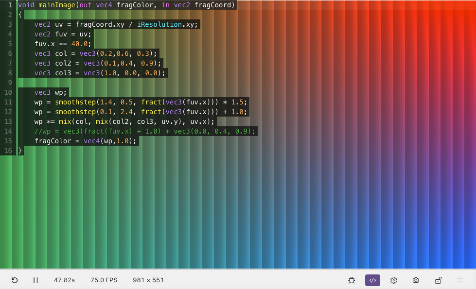

# Editor Overlay

The editor overlay lets you write shader code directly on top of the preview canvas. You see the shader output behind the code as you type, so you don't have to switch back and forth between the editor and the preview.

The overlay includes editor features designed to feel similar to the VS Code editor.

## Opening

- Click the <i class="codicon codicon-code"></i> **Editor** icon in the toolbar
- Or run **Shader Studio: Toggle Editor Overlay** from the command palette

## Working with Multiple Passes

When your shader has multiple passes — Image, BufferA, BufferB, Common, and so on — each appears as a tab along the top of the overlay. Click a tab to switch to that pass. Changes you make are saved back to the file automatically.

**Double-click** a buffer tab in the config panel to open that pass. See [Locking](locking.md) to keep the preview on your main shader while editing other files.

## Vim Mode

If you prefer Vim keybindings, open the options menu while the overlay is enabled and select **Vim Mode**.

Vim mode supports the standard editing motions provided by the embedded editor, including `/` search:

| Key | Action |
|-----|--------|
| `/` | Search forward in the overlay |

## Next

[Compile Modes](compile-modes.md) — choose when the shader recompiles
