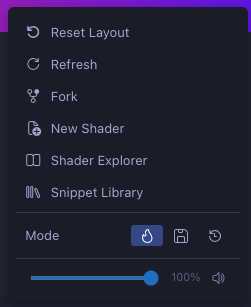

# Options Menu

Click the **Menu** button (<i class="codicon codicon-menu"></i>) in the toolbar to access shader actions:

| Action | Description |
|--------|-------------|
| <i class="codicon codicon-discard"></i> Reset Layout | Reset docked panels to their default positions |
| <i class="codicon codicon-refresh"></i> Refresh | Force recompile and re-render |
| <i class="codicon codicon-repo-forked"></i> Fork | Duplicate the current shader to a new file |
| <i class="codicon codicon-new-file"></i> New Shader | Create a new shader from the default template |
| <i class="codicon codicon-book"></i> Shader Explorer | Browse shaders in your workspace |
| <i class="codicon codicon-library"></i> Snippet Library | Insert GLSL building blocks |
| **Mode** | Choose between <i class="codicon codicon-flame"></i> **Hot** (compile on every change), <i class="codicon codicon-save"></i> **Save** (compile on file save), or <i class="codicon codicon-clock"></i> **Manual** (compile on demand). See [Compile Modes](compile-modes.md). |
| <i class="codicon codicon-unmute"></i> / <i class="codicon codicon-mute"></i> **Volume** | Global volume slider and mute toggle for all audio channel inputs |
