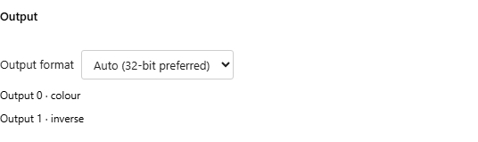

# Multiple render targets

A native WGSL or Slang buffer fragment can write several color textures in one draw. Each texture shares the buffer's resolution and floating-point output format. Image remains a single canvas output; GLSL MRT is not supported.

Declare contiguous color locations starting at zero:

```wgsl
struct Outputs {
  @location(0) color: vec4f,
  @location(1) normal: vec4f,
}
@fragment fn shade() -> Outputs {
  return Outputs(vec4f(1, 0, 0, 1), vec4f(0, 0, 1, 1));
}
```

Slang uses `float4` fields with `SV_Target0`, `SV_Target1`, and so on. Declaration order does not change attachment indices. A depth result (`frag_depth` or `SV_Depth`) is separate from color outputs.

Shader Studio infers the attachment count, slots, and default names from the selected fragment's return declaration. Select the fragment function and connect an output in a downstream input; no `outputs` list is required:

```json
{
  "version": "1.0",
  "passes": {
    "BufferA": {
      "path": "scene.wgsl",
      "entryPoints": { "fragment": "shade" },
      "outputFormat": "rgba16float"
    },
    "Image": {
      "inputs": {
        "iChannel0": { "type": "buffer", "source": "BufferA", "output": 1 }
      }
    }
  }
}
```

Omitting an input's `output` selects attachment zero. Compute outputs continue to use `layer`; render attachments use `output`. The consuming channel still needs an explicit choice when you want a nonzero attachment: code discovery cannot decide which texture that channel should sample.

The buffer's **Output** section shows read-only rows such as **Output 0 · color** and **Output 1 · normal**, alongside the shared **Output format** setting. Add or remove fields in your fragment return type to change the attachments. The UI does not rewrite shader code or add attachments. Older `outputs` arrays remain optional labels by slot; they do not determine the count or create missing attachments.



Discovery reads the pass source and Common declarations. WGSL supports direct `@location(0)` returns, return structs, and aliases to those types. Slang supports direct `SV_Target` returns and structs with `SV_TargetN` fields. Slots must be unique and contiguous from zero; color values must be four-component float vectors. Missing functions, incomplete return declarations, and invalid slot layouts produce an error instead of inventing outputs. A Built-in `mainImage` pass has one color output; multiple attachments require a native fragment.

## Choose an Output in a Channel

1. Configure the consuming channel, such as Image's `iChannel0`, and open **Misc**.
2. Select the source buffer. For multiple attachments, **Buffer output** lists a separate radio row for each slot and its inferred field name.
3. Select the desired output. This saves the channel's `output` number; changing the field name does not change that slot.

Filter and wrap remain channel settings. For a compute source, Misc offers **Compute output layer** when the source has several layers. If an edited fragment removes the selected attachment, the channel shows that it is unavailable until you choose a valid one.

## Try Two WGSL Outputs

Paste this into a WGSL buffer source, select **@fragment twoOutputs**, and leave its vertex source **Built-in**:

```wgsl
struct BufferOutputs {
    @location(0) colour: vec4f,
    @location(1) inverse: vec4f,
}

@fragment
fn twoOutputs(
    @builtin(position) position: vec4f
) -> BufferOutputs {
    let uv = fract(position.xy / 256.0);

    return BufferOutputs(
        vec4f(uv, 0.0, 1.0),
        vec4f(1.0 - uv, 1.0, 1.0)
    );
}
```

In Image, bind a channel to that buffer through **Misc**. Switch between **Output 0 · colour** and **Output 1 · inverse** to see two different gradients. The Image shader must sample that channel; for a Built-in WGSL Image hook:

```wgsl
fn mainImage(coord: vec2f) -> vec4f {
    let uv = coord / iResolution.xy;
    return iChannel0Sample(uv);
}
```

Select **mainImage** in Image's fragment function rows if it previously used a native fragment. The main Image file and buffer source can be separate files or share one file, with the correct function selected for each pass.

## Limits and Debugging

The available count depends on the device's attachment count and bytes per sample. `rgba16float` uses 8 bytes per attachment and `rgba32float` uses 16. Five `rgba16float` outputs therefore require at least five attachments and 40 bytes per sample. Shader Studio requests supported limits and reports an error when a configuration exceeds them. All attachments swap together for feedback and share resize/reset behavior.

Native previews and capture retain the authored vertex stage, interpolated inputs, viewer camera, and depth. Variable capture renders to scratch attachments and snapshots storage buffers, so it leaves live output textures and storage unchanged. Select the output in the debug panel to preview or post-process its color. Other fragment output fields remain intact during instrumentation.

Runnable WGSL and Slang examples are in `tests/fixtures/shader-corpus/*/native-mrt/`.

Shadertoy imports keep their single-output `mainImage` behavior and existing connections select output zero. Native MRT projects cannot be pasted directly into Shadertoy. Porting them requires splitting outputs into separate passes or packing several values into one texture; splitting can duplicate calculations and lose the benefit of writing several outputs in one draw. Shader Studio does not convert MRT projects automatically.
