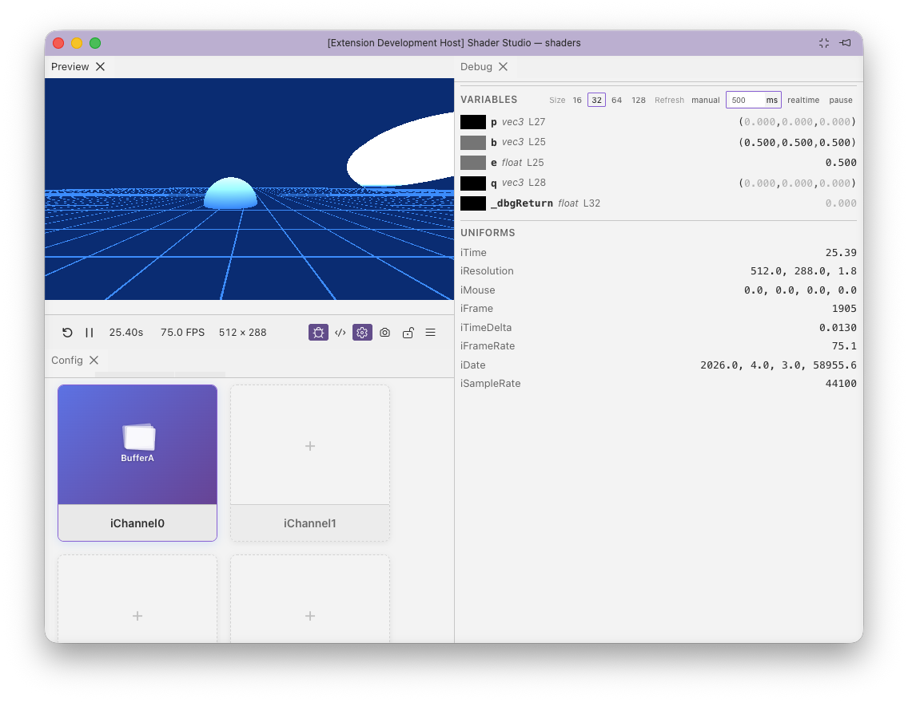

# Panel Layout

Shader Studio uses a dockable panel system. Panels (Preview, Debug, Config, Performance) can be rearranged:

- **Drag a tab header** to move a panel to a different group
- **Drag to an edge** (left, right, top, bottom) of an existing group to split it
- **Drag the sash** (the divider between panels) to resize
- **Tab headers** auto-hide when only one panel is in a group. To view the tabs again, move your mouse near the top of the panel and they will appear

The layout is saved automatically. Use **Menu → Reset Layout** to return to the default arrangement.

## Next

[Locking](locking.md) — keep the preview pinned to a specific shader
