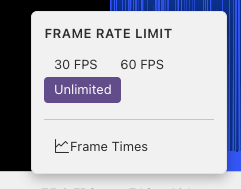
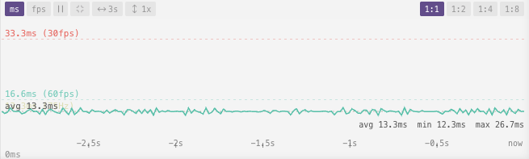

# Performance

The **FPS** display in the preview toolbar shows the live frame rate.

Click it to open the FPS menu:

- **Frame rate limit**: Unlimited, 60 fps, or 30 fps
- **Frame Times**: Toggle the frame times panel

## Frame Times Panel

The frame times panel shows a real-time graph of your shader's rendering performance.

### Reading the Graph

The graph plots frame time (in milliseconds) on the Y-axis over recent history on the X-axis.

**Reference lines:**

| Line | Value | Meaning |
|------|-------|---------|
| Green | 16.6ms | 60 fps |
| Red | 33.3ms | 30 fps |
| Yellow | Auto-detected | Your screen refresh rate |

A dashed line shows the **average of the visible time window**.

Switch between **ms** and **fps** views with the toggle buttons.

### Controls

#### Zoom and Pan

| Action | Effect |
|--------|--------|
| Drag | Pan through history |
| Ctrl + scroll | Zoom Y-axis (1×–32×) |
| Click zoom button | Cycle Y-axis zoom |
| Scroll | Change the time window width |
| **Center** button | Re-center the visible area on the average |

#### Time Window

A single button cycles through sample counts, showing more or less history. The default view is 180 frames (≈3 seconds at 60 fps).

#### Downsample

When viewing a long stretch of history, the downsample control averages frames together so the graph draws fewer points (1:1, 1:2, 1:4, 1:8). Higher values keep the graph responsive when zoomed out.

#### Pause

Click **Pause** to freeze the graph. Useful for inspecting a specific spike. Click again to resume. The graph also auto-pauses while you drag to pan.

### Tips

- A spike above the 16.6ms line means a frame was rendered slower than 60 fps
- Consistent high values suggest the shader is GPU-bound; try lowering the resolution scale
- Zoom in vertically (Ctrl+scroll up) to magnify small variations
- Pan left to examine earlier history

## Next

[Resolution](resolution.md) — change the render size, aspect ratio, and zoom
