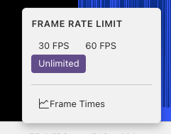
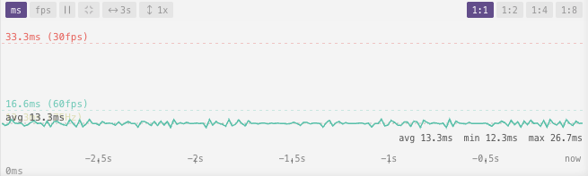

# Performance

The **FPS** display in the preview toolbar shows the live frame rate.

Click it to open the FPS menu:

- **Frame rate limit**: Unlimited, 60 fps, or 30 fps
- **Performance**: Toggle the performance panel

## Performance Panel

The performance panel shows a real-time graph of your shader's rendering performance.

### Reading the Graph

The graph plots frame time (in milliseconds) on the Y-axis over recent history on the X-axis.

**Reference lines:**

| Line | Value | Meaning |
|------|-------|---------|
| Green | 16.6ms | 60 fps |
| Red | 33.3ms | 30 fps |
| Yellow | Auto-detected | Your screen refresh rate |

A dashed line shows the **average of the visible time window**.

Switch between **ms** and **fps** views with the toggle buttons.

### Statistics

Below the graph, these statistics summarise the visible window and follow its zoom
and pan:

| Value | Meaning |
|-------|---------|
| **p50** | Typical frame time |
| **p95** | The slowest 5% of frames — where a stutter appears first |
| **worst** | The slowest single frame |
| **late** | Number of frames that overran the window's own frame time by a whole refresh, holding the previous image on screen |
| **gpu** | How long the GPU took to finish a frame — see the note below on comparing engines |

An average frame rate can look healthy while frames arrive unevenly, and
uneven delivery is what the eye reads as stuttering. When the preview looks
jumpy but the FPS display seems fine, check **late** and **worst** rather than
the frame rate — a couple of late frames per second is enough to see, while
barely moving the average.

Compare **gpu** with **p50** before and after a change while using the same
shader language. Measurements differ between GLSL and Slang/WGSL, so avoid
direct comparisons between them. A much higher **gpu** value can mean the GPU
is falling behind, even if the FPS display looks healthy.

**Late** measures uneven frame delivery at the shader's current rate. A shader
running steadily at 30 fps has no late frames; occasional delays increase the count.

### Logging to the Console

Use the toolbar's output button to log a performance summary to the developer
console once per second. Copy the results to compare runs.

### Controls

#### Zoom and Pan

| Action | Effect |
|--------|--------|
| Drag | Pan through history |
| Ctrl + scroll | Zoom Y-axis (1×–32×) |
| Click zoom button | Cycle Y-axis zoom |
| Scroll | Change the time window width |
| **Center** button | Re-center the visible area on the average |

#### Time Window

A single button cycles through sample counts, showing more or less history. The default view is 180 frames (≈3 seconds at 60 fps).

#### Downsample

When viewing a long stretch of history, the downsample control averages frames together so the graph draws fewer points (1:1, 1:2, 1:4, 1:8). Higher values keep the graph responsive when zoomed out.

#### Pause

Click **Pause** to freeze the graph. Useful for inspecting a specific spike. Click again to resume. The graph also auto-pauses while you drag to pan.

### Tips

- A spike above the 16.6ms line means a frame was rendered slower than 60 fps
- Consistent high values suggest the shader is GPU-bound; try lowering the resolution scale
- Zoom in vertically (Ctrl+scroll up) to magnify small variations
- Pan left to examine earlier history

## Next

[Debug Mode](../debugging/index.md) — inspect and analyse your shader while it runs
