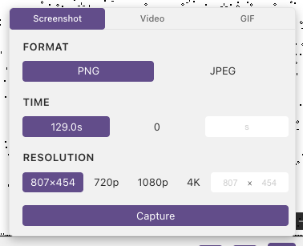
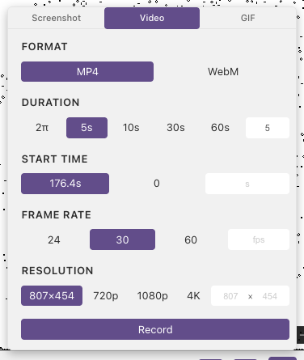
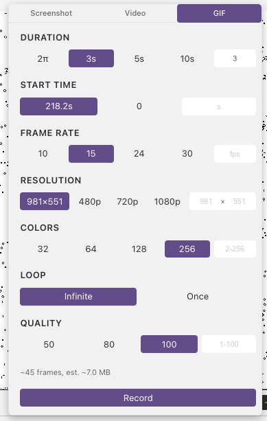

# Recording

Shader Studio can capture your shader output as a screenshot, video, or animated GIF.

## Opening the Recording Panel

Click the <i class="codicon codicon-device-camera"></i> **Record** button in the toolbar, or open **Menu → Export**.

## Screenshot

Capture a single frame as a PNG or JPEG.

| Option | Description |
|--------|-------------|
| **Format** | PNG or JPEG |
| **JPEG quality** | 0–100 (JPEG only). Higher = better quality, larger file. |
| **Time** | Shader time at which to capture. Defaults to current time. |
| **Resolution** | 480p, 720p, 1080p, 4K, or custom pixel dimensions |

Click **Capture** to save. A live canvas preview updates as you change options.

## Video

Record shader output as an MP4 (H.264) or WebM (VP8) file using the browser's WebCodecs API.

| Option | Description |
|--------|-------------|
| **Format** | MP4 or WebM |
| **Start time** | Shader time to begin recording from |
| **Duration** | Presets: 2π (≈6.3s), 5s, 10s, 30s, 60s, or custom |
| **FPS** | 24, 30, 60, or custom |
| **Resolution** | 480p, 720p, 1080p, 4K, or custom |

Click **Record** to start. A progress bar shows rendering and finalization phases. Click **Cancel** to abort.

## GIF

Record an animated GIF using the gifski encoder (WASM).

| Option | Description |
|--------|-------------|
| **Start time** | Shader time to begin from |
| **Duration** | Presets or custom |
| **FPS** | 10, 15, 24, 30, or custom |
| **Colors** | Palette size: 32, 64, 128, 256 |
| **Loop** | Infinite or play once |
| **Quality** | 1–100 (higher = better quality, larger file) |

An estimated file size is shown before recording. Click **Record** to start.

**Tips:**
- For shaders you usually want **Quality 100** to preserve fine detail, but try reducing it if the file is too large
- Lower FPS and color counts also produce smaller GIF files

## Next

[Open in Browser](web-server.md) — preview your shader in a web browser
