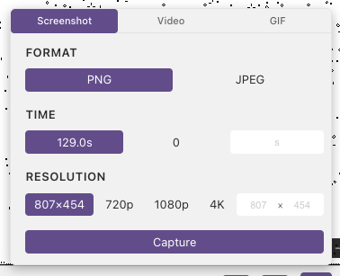
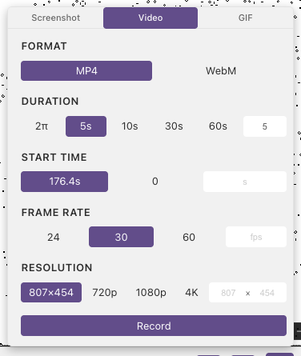
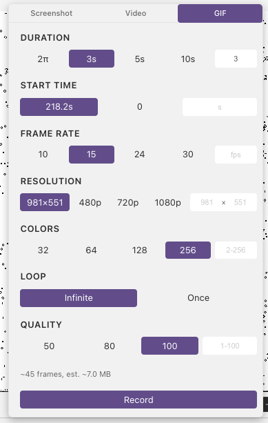

# Recording

Shader Studio can capture your shader output as a screenshot, video, or animated GIF.

## Opening the Recording Panel

Click the <i class="codicon codicon-device-camera"></i> **Record** button in the toolbar, or open **Menu → Export**.

## Screenshot

Capture a single frame as a PNG or JPEG. **Live** captures the pixels currently
shown in the preview without changing shader time or resolution. **Render**
creates a separate capture at a selected time and resolution.

| Option | Description |
|--------|-------------|
| **Format** | PNG or JPEG |
| **Mode** | Live preview pixels, or a separate Render capture |
| **Capture frame at** | Shader time for Render mode: `0` or a time you enter. Preceding frames are rendered first. |
| **Resolution** | Current, 720p, 1080p, 4K, or custom dimensions in Render mode |

Click **Capture screenshot** to save. Render mode simulates every preceding
frame before the requested frame, so feedback buffers and `iFrame` match a
continuous run rather than jumping directly to the selected time.

## Video

Record shader output as an MP4 (H.264) or WebM file. **Live** records the
existing preview until you choose **Stop & save**; it does not restart the
shader or create another rendering engine. **Render** produces a deterministic
clip at a chosen time, duration, and resolution.

| Option | Description |
|--------|-------------|
| **Format** | MP4 or WebM |
| **Mode** | Live preview recording, or a separate Render recording |
| **Start recording at** | Shader time for Render mode: `0` or a time you enter. Preceding frames are rendered first. |
| **Duration** | Render presets: 2π (≈6.3s), 5s, 10s, 30s, 60s, or custom |
| **FPS** | Screen, 24, 30, 60, or custom. In Render mode, Screen rounds to 24, 30, 60 or 120 fps |
| **Resolution** | Current, 720p, 1080p, 4K, or custom in Render mode |

Live recording uses WebCodecs when available, with explicit per-frame quality
to preserve smooth shader gradients. MP4 dimensions are rounded up to even
pixels to avoid encoder edge artifacts. WebM prefers VP9, with a VP8 fallback.
Hosts without WebCodecs use MediaRecorder, so the formats offered depend
on the host: a format it can't record is disabled, and a saved choice it can't
record falls back to one it can, with a note in the panel. MP4 needs even
dimensions; an odd custom size is rounded up and the panel tells you the saved
size. Video quality is automatic. Live recordings request minimum quantization
and prefer software encoding for fidelity over hardware speed or compression;
complex shaders can therefore produce larger files. Render and bitrate fallback
encoders use variable bitrate with a
high ceiling (5 bits per pixel), so detailed, fast-changing shaders keep their
detail while simple shaders stay small, because the encoder only spends what the
content needs. Video stores colour at half resolution (4:2:0), so single-pixel
coloured detail softens in any video file; use a PNG screenshot when
exact colour per pixel matters. Render mode shows separate preparation, rendering, encoding, and
saving phases. Click **Cancel** to abort a Render recording. During a Live
recording, choose **Discard** or **Stop & save**. A Live recording keeps a fixed
output size: if the preview is resized while recording, the preview is scaled
until recording ends and then takes the new size. Editing the shader keeps
recording. Opening a different shader stops the recording and saves what was
recorded up to that point.

## GIF

Record an animated GIF.

| Option | Description |
|--------|-------------|
| **Start recording at** | Shader time: `0` or a time you enter. Preceding frames are rendered first. |
| **Duration** | Presets or custom |
| **FPS** | 10, 15, 24, 30, or custom |
| **Loop** | Infinite or play once |
| **Quality** | 1–100 (higher = better quality, larger file) |

An estimated file size is shown before recording. Captures that would require
an unsafe amount of raw frame memory are rejected with guidance to reduce the
duration, FPS, or resolution. Click **Record** to start.

**Tips:**
- For shaders you usually want **Quality 100** to preserve fine detail, but try reducing it if the file is too large
- Lower FPS and resolution also produce smaller GIF files

## Capture state and settings

Render captures freeze the shader source, pass configuration, buffers, language
modules, source paths, and current custom-uniform values when capture begins.
Later editor or script updates do not change a capture already in progress.

Each output remembers its own settings across reloads. Encoding, browser
capability, memory, and save failures are shown in the Recording panel. Saving
remains visible until the host confirms completion.

## Limitations

- **Live video is silent.** It records the canvas only; shader audio inputs
  are not mixed into the file.
- **Render doesn't replay live input.** Custom and script uniforms are a
  snapshot taken when the export starts and stay constant for the whole
  export. `iMouse` stays at its idle value, keyboard input is idle, and audio
  or video inputs play on the wall clock rather than the export timeline. The
  panel names the inputs your shader uses when this applies. Use **Live** to
  capture interaction.
- **Render preparation cost.** A Render start time is reached by rendering
  every preceding frame from time `0` (at 60 fps for screenshots, at the
  export frame rate for video and GIF). Start times are limited to 3600 s.
- **Live recording smoothness** depends on how fast the shader renders; a
  shader that stutters in the preview records the same stutter.

## Next

[Open in Browser](web-server.md) — preview your shader in a web browser
