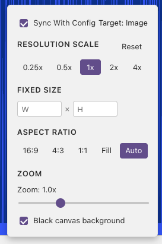

# Resolution

The **Resolution** button in the preview toolbar shows the current canvas size. Click it to change how large the shader renders.

## How It Works

Resolution changes through a simple toggle: **Sync with Config**.

### Sync with Config — On (Default)

When the checkbox is ticked, every change you make is saved to the shader's config file (`.sha.json`). The next time you open this shader, it will use the same resolution.

Use this when you want a specific resolution to stick with the shader — for example, forcing a 720p output for a particular effect.

### Sync with Config — Off

When the checkbox is unticked, your changes are **session-only** — they are not saved to the config file. The session override stays active for all shaders until you close Shader Studio or turn sync back on.

Use this when you want to temporarily test a different size — for example, dropping to half resolution to see if performance improves — without changing the saved config.

---

## Resolution Options

- **Scale presets** — Quick multipliers: 0.25x, 0.5x, 1x, 2x, 4x. Scale is applied on top of everything else.
- **Custom resolution** — Type an exact width and height in pixels. When set, this overrides scale and aspect ratio.
- **Aspect ratio** — 16:9, 4:3, 1:1 (square), Fill (use all available space), or Auto (match your screen).
- **Black background** — Fill the area around the shader with black instead of the editor background.
- **Zoom** — Magnify the preview visually without changing the actual render size (0.1x to 3.0x).

!!! tip
    **Scale still applies when custom resolution is set.** For example, a custom size of `320 × 180` at `2x` renders at `640 × 360`.

---

## Setting Resolution in the Config Panel

You can also set the resolution from the **Config** panel. Open it from the toolbar, go to the **Image** tab, and set the resolution there. This is the same as using the toolbar with **Sync with Config** enabled.

See [Configure Buffers and Inputs](config-buffers.md) for the full guide on setting up passes, channels, and resolution through the config panel.

---

## Buffer Resolution

Buffer passes have their own resolution settings, but these can only be edited from the **Config** panel, not the resolution toolbar.

See [Configure Buffers and Inputs](config-buffers.md) for how to set buffer resolution.

## Next

[Panel Layout](panel-layout.md) — rearrange and dock panels
