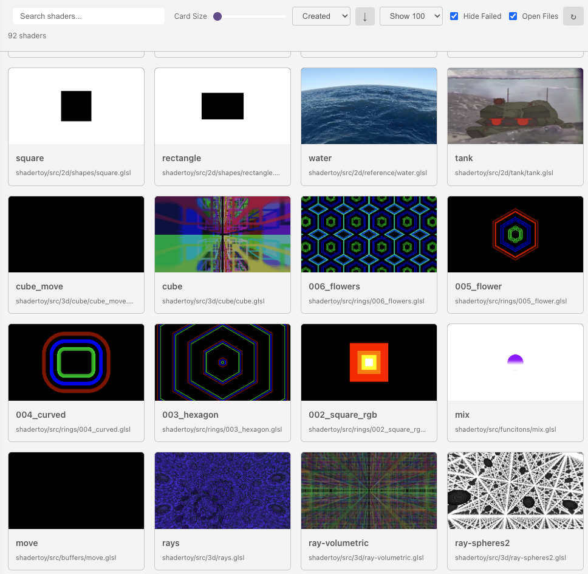

# Shader Explorer

Shader Explorer lets you browse, search, and preview all shader files in your workspace.

## Opening

- Toolbar menu → **Shader Explorer**
- Command palette → **Shader Studio: Open Shader Explorer**

## Search and Sort

- **Search** — type in the search bar to filter shaders by name or path (case-insensitive)
- **Sort by** — dropdown with options:
    - **Name** — alphabetical A–Z
    - **Updated** — most recently modified first
    - **Created** — newest first
- **Sort order** — toggle button to switch ascending/descending

## Display Options

- **Card size** — slider (200–1000px width) to control how large shader cards appear
- **Page size** — dropdown to show 10, 20, 30, 50, or 100 shaders per page
- **Hide failed** — checkbox to hide shaders that failed to compile

## Refresh

Click the **refresh button** to re-scan the workspace for shaders and regenerate thumbnails. There is a short rendering delay (~3 seconds) while thumbnails are captured.

## Next

[Snippet Library](snippet-library.md) — insert reusable GLSL code blocks
