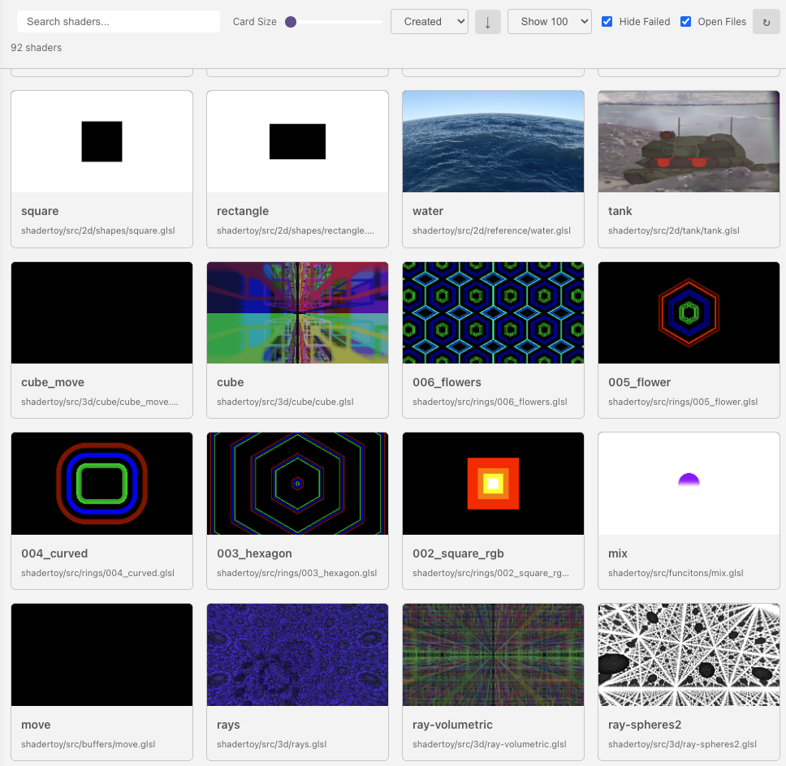

# Shader Explorer

Shader Explorer lets you browse, search, and preview all shader files in your workspace. It supports both GLSL (`.glsl`, `.frag`, `.vert`) and Slang (`.slang`) shaders, with WebGL or WebGPU preview rendering selected automatically by shader language.

## Opening

The Shader Explorer is available in two forms — the **sidebar** for persistent browsing, and the **full panel** for focused exploration.

- **Sidebar** — click the  **Shader Studio** icon in the VS Code activity bar. The explorer appears as a sidebar view you can keep open alongside your editor.
- **Full panel** — open the toolbar menu and choose **Shader Explorer**, or run **Shader Studio: Open Shader Explorer** from the command palette.

State (search, sort, page, card size) persists independently for each view.

## Browsing and Navigation

Each shader in your workspace appears as a card showing a live-rendered thumbnail preview, the shader filename, and its last-modified date.

- **Click a card** to open the shader file in the editor and refresh its thumbnail preview.
- **Right-click a card** to open a context menu with options to open the shader, open its config, or delete it.
- **Open files on select** — when enabled, clicking a card opens the shader file in the editor. Toggle this off in the options panel if you prefer to browse thumbnails without switching files.

## Search and Sort

- **Search** — type in the search bar to filter shaders by name, path, or shader source text (case-insensitive). Name matches are shown before path and source-text matches. Multiple terms are combined, quoted phrases match exactly, and terms prefixed with `-` are excluded, e.g. `ray sphere -buffer` or `"ray march"`.
- **Sort by** — dropdown with options:
    - **Name** — alphabetical A–Z
    - **Updated** — most recently modified first
    - **Created** — newest first
- **Sort order** — toggle button to switch ascending/descending

## Display Options

Click the options button to expand the display settings panel:

- **Card size** — slider (100–1000px width) to control how large shader cards appear. Only available in grid layout mode.
- **Layout** — toggle between **grid** (cards in a responsive grid) and **row** (cards in a single-column list with larger thumbnails).
- **Page size** — dropdown to show 10, 20, 30, 50, or 100 shaders per page.
- **Hide failed** — checkbox to hide shaders that failed to compile or render.
- **Open files on select** — checkbox to control whether clicking a card opens the file in the editor.

## Refresh

Click the **refresh button** in the toolbar to re-scan the workspace for shaders and regenerate all thumbnails. There is a short rendering delay (~3 seconds) while thumbnails are captured.

Clicking an individual shader card also refreshes that shader's thumbnail — useful after editing a shader to update its preview in the explorer.

## File Management

- **New shader** — click the **+** button in the toolbar to create a new shader file from a template.
- **Delete shader** — right-click a card and choose **Delete** to move the shader file to the trash. If the shader has dependent buffer pass files, a confirmation dialog warns you before deleting.

## Next

[GLSL and Slang Code Snippets](code-snippets.md) — insert bundled shader code through native VS Code completion
