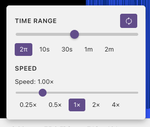

# Time and Playback Controls

Time controls let you scrub through shader animations, loop specific time ranges, and adjust playback speed.

## Opening

Click the **time display** (e.g. `42.53s`) in the toolbar to expand the time controls menu.

## Time Scrubbing

Drag the **time slider** to manually set the shader time. The shader updates in real time as you scrub.

When loop mode is enabled, the slider range matches the selected loop duration. When loop is off, the slider covers the full elapsed time.

## Loop Mode

Click the **loop button** to enable looping. When active, shader time wraps around at the end of the selected duration.

### Duration Presets

Quick buttons to set the loop range:

| Preset | Duration | Use Case |
|--------|----------|----------|
| **2π** | 6.28s | Trigonometric cycles (`sin(iTime)`, `cos(iTime)`) |
| **10s** | 10s | Short animations |
| **30s** | 30s | Medium animations |
| **1m** | 60s | Longer sequences |
| **2m** | 120s | Extended animations |

## Playback Speed

Adjust how fast time advances with the **speed slider** (0.25x to 4.0x in 0.25 increments).

### Speed Presets

| Preset | Use Case |
|--------|----------|
| **0.25x** | Slow motion — inspect fast animations frame by frame |
| **0.5x** | Half speed — see timing details |
| **1x** | Normal speed |
| **2x** | Double speed — quickly preview long animations |
| **4x** | Fast forward |

## Next

[Performance](performance.md) — cap the frame rate and monitor rendering performance
