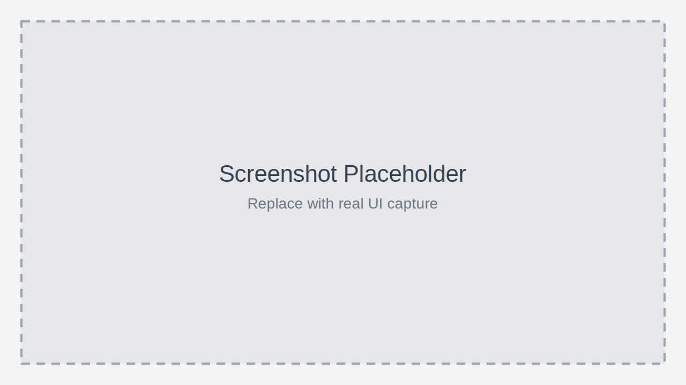

# Config File Format (`.sha.json`)


Config files define multi-pass rendering pipelines and input channel bindings for your shaders. They open in a visual editor by default, but you can also edit the JSON directly.

## Naming Convention

The config file must share the same base name as your shader:

- Shader file: `example.glsl`
- Config file: `example.sha.json`

Place them in the same directory. To generate a config automatically, run **Shader Studio: Generate Config for GLSL File** from the command palette.

## Visual Config Editor


_Placeholder: `reference-config-editor.png` — Visual config editor showing tabs for Image and BufferA, with input channels configured and a texture selected._

The visual editor provides:

- **Tab navigation** — one tab per pass (Image, BufferA, BufferB, etc.)
- **Add pass** — click **+ New** to add a Buffer, Common, or Script pass
- **Remove pass** — click the × on non-Image tabs
- **Input channels** — configure `iChannel0–3` for each pass with a modal dialog
- **Buffer path** — set which `.glsl` file each buffer pass reads from
- **Script tab** — configure a custom uniforms script: set the JS/TS file path, adjust polling FPS, and view current uniform values and types
- **Toggle to source** — switch to raw JSON editing with the toolbar button

## Basic Example

A single-pass shader with no inputs:

```json
{
  "version": "1.0",
  "passes": {
    "Image": {
      "inputs": {}
    }
  }
}
```

## Multi-Pass Example

Image reads from BufferA, BufferA reads keyboard input:

```json
{
  "version": "1.0",
  "passes": {
    "Image": {
      "inputs": {
        "iChannel0": { "source": "BufferA", "type": "buffer" }
      }
    },
    "BufferA": {
      "path": "bufferA.glsl",
      "inputs": {
        "iChannel1": { "type": "keyboard" }
      }
    }
  }
}
```

## Texture Input Example

Bind an image file to a channel:

```json
{
  "version": "1.0",
  "passes": {
    "Image": {
      "inputs": {
        "iChannel0": { "path": "textures/noise.png", "type": "texture" }
      }
    }
  }
}
```

## Video Input Example

Bind a video file:

```json
{
  "version": "1.0",
  "passes": {
    "Image": {
      "inputs": {
        "iChannel0": { "path": "videos/timelapse.mp4", "type": "video" }
      }
    }
  }
}
```

## Audio Input Example

Bind an audio file. The texture provides FFT frequency data (row 0) and waveform data (row 1), matching Shadertoy's audio format:

```json
{
  "version": "1.0",
  "passes": {
    "Image": {
      "inputs": {
        "iChannel0": {
          "type": "audio",
          "path": "music/track.mp3",
          "startTime": 0,
          "endTime": 30
        }
      }
    }
  }
}
```

Access in GLSL:

```glsl
float fft  = texture(iChannel0, vec2(uv.x, 0.25)).r; // FFT row
float wave = texture(iChannel0, vec2(uv.x, 0.75)).r;  // Waveform row
```

## Cubemap Input Example

Bind a T-cross layout cubemap image. The channel is bound as a `samplerCube`:

```json
{
  "version": "1.0",
  "passes": {
    "Image": {
      "inputs": {
        "iChannel0": {
          "type": "cubemap",
          "path": "textures/skybox.png",
          "filter": "mipmap"
        }
      }
    }
  }
}
```

Access in GLSL (channel must be declared as `samplerCube`):

```glsl
vec4 col = texture(iChannel0, normalize(dir));
```

## Script-Driven Uniforms

Add a `script` field to run a TypeScript or JavaScript file that computes custom uniform values each frame. The script exports named values; their types are inferred automatically:

```json
{
  "version": "1.0",
  "script": "uniforms.ts",
  "scriptMaxPollingFps": 30,
  "passes": {
    "Image": { "inputs": {} }
  }
}
```

Example `uniforms.ts`:

```typescript
export const uSpeed: float = iTime * 0.5;
export const uColor: vec3 = [Math.sin(iTime), 0.5, 1.0];
```

Available context variables: `iTime`, `iFrame`, `iResolution`, `iMouse`, `iDate`, `iChannelTime`, `iSampleRate`.

Supported uniform types: `float`, `vec2`, `vec3`, `vec4`, `bool`.

## Resolution Settings

Pin a resolution to the config so it applies whenever the shader is opened:

```json
{
  "version": "1.0",
  "passes": {
    "Image": {
      "resolution": {
        "scale": 1,
        "aspectRatio": "16:9"
      },
      "inputs": {}
    }
  }
}
```

Custom pixel dimensions:

```json
"resolution": {
  "customWidth": 1920,
  "customHeight": 1080
}
```

Custom dimensions are the base size. `scale` still applies if you set both:

```json
"resolution": {
  "scale": 2,
  "customWidth": 320,
  "customHeight": 180
}
```

This renders at `640 × 360`.

Buffer passes use a simpler fixed-size resolution:

```json
"BufferA": {
  "path": "bufferA.glsl",
  "resolution": { "width": 512, "height": 512 }
}
```

## Passes

| Pass | Description |
|------|-------------|
| **Image** | Main output pass (required, always present) |
| **BufferA–D** | Intermediate render passes. Each renders to its own framebuffer and can be read by other passes. |
| **Common** | Shared GLSL code included in all passes. Useful for shared functions and constants. |

Each non-Image pass needs a `path` field pointing to its `.glsl` file. If the file doesn't exist, the visual editor offers a button to create it.

## Channel Types

Each pass can bind up to 4 input channels (`iChannel0` through `iChannel3`):

| Type | Fields | Description |
|------|--------|-------------|
| `buffer` | `source` | Read from another pass (e.g. `"source": "BufferA"`) |
| `texture` | `path`, `filter`, `wrap`, `vflip`, `grayscale` | Image file |
| `video` | `path`, `filter`, `wrap`, `vflip` | Video file |
| `audio` | `path`, `startTime`, `endTime` | Audio file with FFT/waveform texture |
| `cubemap` | `path`, `filter`, `wrap`, `vflip` | T-cross cubemap image |
| `keyboard` | — | Key state input texture |

### Texture / Video / Cubemap Options

| Field | Values | Description |
|-------|--------|-------------|
| `filter` | `mipmap` (default), `linear`, `nearest` | Texture filtering |
| `wrap` | `clamp` (default), `repeat` | Edge wrap mode |
| `vflip` | `true` / `false` | Flip vertically |
| `grayscale` | `true` / `false` | Texture only: convert to greyscale |

## Buffer Self-Read

A buffer can read its own previous frame's output by binding itself as an input:

```json
{
  "BufferA": {
    "path": "bufferA.glsl",
    "inputs": {
      "iChannel0": { "source": "BufferA", "type": "buffer" }
    }
  }
}
```

This is how Shadertoy-style feedback effects work (trails, fluid simulations, game of life).

## File Paths

Paths in the config are relative to the config file's directory. Keep all referenced files (buffer `.glsl` files, textures, videos, audio) in the same directory or subdirectories.
