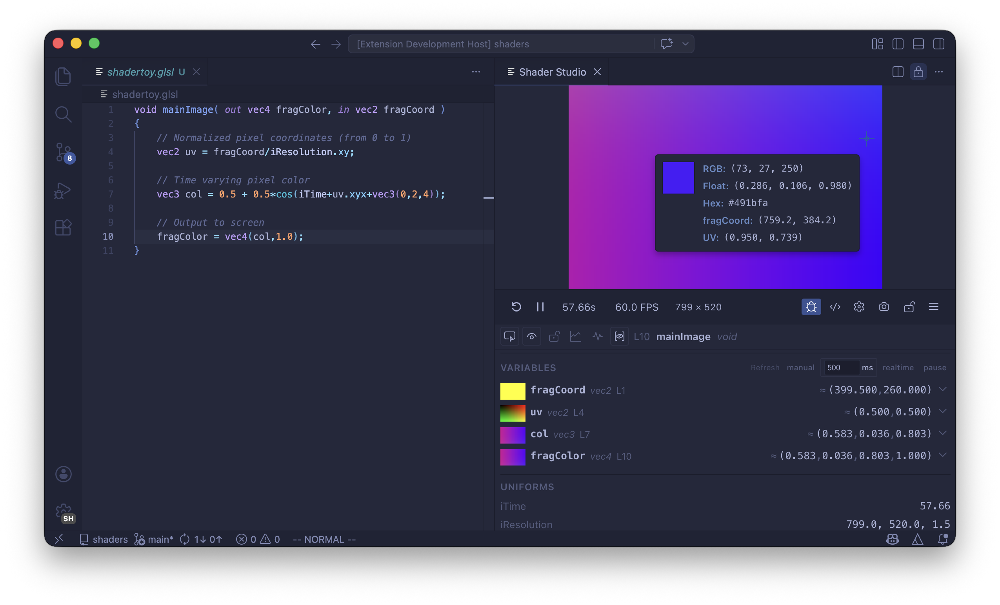

# Shader Studio User Guide

Shader Studio is a VS Code extension for live previewing, editing, and debugging Shadertoy-style GLSL shaders. It gives you a real-time GPU canvas inside your editor, a visual debugger that lets you see what every line computes, and a full pipeline for multi-pass effects — all without leaving VS Code.

Use these docs to learn how to develop, preview, and debug shaders in Shader Studio.

---

## What You Can Do

### Live Shader Preview

Write GLSL in VS Code and see the result instantly. Every keystroke recompiles and updates the preview. Shader Studio runs Shadertoy-style fragment shaders with the familiar `mainImage(out vec4 fragColor, in vec2 fragCoord)` entry point, so shaders from Shadertoy and tutorials work with little or no modification.

### Multi-Pass Pipelines

Build complex effects with buffer passes that render offscreen and feed into each other. Set up feedback loops for particle trails, blur chains, post-processing stacks, and simulation grids. A visual config panel manages the pipeline and writes the `.sha.json` file for you.

See [Configure Buffers and Inputs](features/config-buffers.md) for the full guide.

### Visual Debugging

Place your cursor on any line and see the value of that variable rendered across the whole screen in real time. Debug mode works inside `mainImage`, helper functions, buffer passes, and even loops. You can inspect variables in a grid, normalize value ranges, and cap loop iterations to debug expensive shaders without crashing the GPU.

See [Debug Mode Overview](debugging/index.md) to get started.

### Rich Input Channels

Bind textures, videos, audio files, cubemaps, keyboard state, and even the output of other buffer passes to `iChannel0`–`iChannel15`. Audio channels provide FFT spectrum and waveform data. Keyboard channels give you held, pressed, and toggle states per key. Everything is configured through the visual config panel — no manual uniform declarations needed.

### Time & Playback Controls

Scrub time, loop sections, change playback speed, or pause entirely. The timeline controls are precise enough to frame-scrub an animation and find the exact frame you want to capture.

See [Time and Playback Controls](features/time-controls.md).

### Recording

Take screenshots or record MP4 video and GIF animations directly from the preview. Recordings use the live canvas resolution and respect the current time, paused state, and playback speed.

See [Recording](features/recording.md).

### Shader Explorer & Snippet Library

Browse your shaders with the built-in Shader Explorer, and use the Snippet Library to insert common GLSL patterns — noise functions, SDF primitives, color utilities, and more.

See [Shader Explorer](features/shader-explorer.md) and [Snippet Library](features/snippet-library.md).

### Editor Overlay

Toggle an inline code overlay on the preview canvas so you can edit shader code while watching the result full-screen.

See [Editor Overlay](features/editor-overlay.md).

### Additional Features

| Feature | Description |
|---------|-------------|
| [Performance](features/performance.md) | Cap the frame rate or open a detailed performance panel |
| [Resolution](features/resolution.md) | Scale the canvas, set custom dimensions, or change aspect ratio |
| [Panel Layout](features/panel-layout.md) | Open the preview as an editor panel or in a separate window |
| [Locking](features/locking.md) | Keep the preview pinned to a shader while you edit other files |
| [Compile Modes](features/compile-modes.md) | Switch between strict and compatibility compilation modes |
| [Open in Browser](features/web-server.md) | Run the preview in a standalone browser window |

---

## Who Is This For?

Shader Studio is built primarily for **shader artists** — anyone who writes Shadertoy-style GLSL for creative expression, prototyping, or learning.

- **Shader artists** who want a Shadertoy-like environment inside their everyday editor, with live preview, visual debugging, and multi-pass pipelines
- **Graphics programmers** prototyping GLSL effects before integrating them into an engine
- **Learners** following shader tutorials and wanting immediate feedback, clear error messages, and tools that make GLSL less opaque

---

## Getting Started

New to Shader Studio? Start here:

[Quick Start](quick-start.md) — install the extension, open your first preview, and understand the toolbar.
