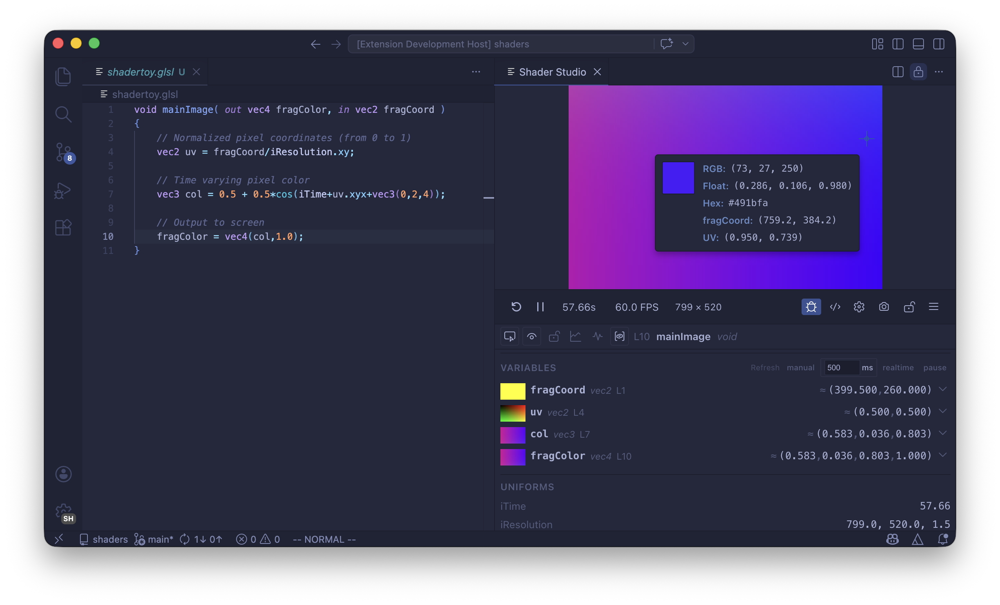

# Shader Studio User Guide

Shader Studio is a VS Code extension for live previewing, editing, and debugging shaders. It closely follows the Shadertoy format but also supports additional features such as Slang compute shaders, vertex shaders, and debugging tools like inspecting the output at different lines or capturing color at different pixels.

Click the  **Shader Studio** icon in the VS Code activity bar to open the Shader Explorer sidebar, where you can browse and preview all shaders in your workspace. Use the sidebar to dive deeper into individual features.

---

[Quick Start](quick-start.md) — install the extension, open your first preview, and understand the toolbar.
