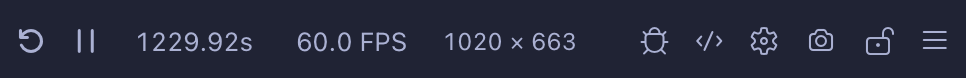

# Quick Start


## Step 1: Install

1. Open VS Code and go to the **Extensions** panel (`Cmd+Shift+X` / `Ctrl+Shift+X`).
2. Search for **Shader Studio** and click **Install**.

Or install directly from the [VS Code Marketplace](https://marketplace.visualstudio.com/items?itemName=teaqu.shader-studio).

## Step 2: Open a Preview


1. Click the  **Shader Studio** icon in the status bar and choose **Open Panel** (or **Open Window** for a separate window).
2. Either open an existing `.glsl` file, or click **☰ menu → New Shader** to create one from a template.

Your shader preview updates live as you edit. Any save or keystroke triggers a recompile.

## Step 3: Write Your Shader

Shader Studio runs Shadertoy-style shaders. Your shader needs a `mainImage` function. If you created your shader with the **New Shader** button, you should see something like this:

```glsl
void mainImage(out vec4 fragColor, in vec2 fragCoord) {
    vec2 uv = fragCoord / iResolution.xy;
    fragColor = vec4(uv, 0.5 + 0.5 * sin(iTime), 1.0);
}
```

!!! note "New to shaders or Shadertoy?"
    A shader is a small program that runs on your GPU. Instead of looping over pixels in code, the GPU runs `mainImage` **once per pixel, in parallel**, every frame.

    The code above breaks down like this:

    - `fragCoord` — the current pixel's position on screen in pixels
    - `iResolution` — the canvas size; dividing gives `uv`, a 0–1 position across the screen
    - `fragColor` — the color you output, as `vec4(red, green, blue, alpha)` where each channel is 0–1
    - `iTime` — seconds elapsed since the shader started, useful for animation

    Shader Studio also provides `iMouse` (mouse position) and other uniforms that match the [Shadertoy](https://www.shadertoy.com) API, so shaders from that site will generally work here too.

    [Watch this video by The Art of Code](https://www.youtube.com/watch?v=u5HAYVHsasc) for a good beginner's introduction.

## Step 3: Use the Toolbar

The preview toolbar gives quick access to all features:



- <i class="codicon codicon-debug-restart"></i> **Reset** — restart the shader and reset time-dependent state
- <i class="codicon codicon-play"></i> / <i class="codicon codicon-debug-pause"></i> [**Play/Pause**](features/time-controls.md) — freeze or resume animation
- [**Time**](features/time-controls.md) — scrub, loop, and control playback speed
- **FPS** — click to set frame rate limit or open the performance monitor
- **Resolution** — click to change scale, aspect ratio, zoom, or set a custom resolution
- <i class="codicon codicon-bug"></i> [**Debug**](workflows/debug-shaders.md) — enable line-by-line visual debugging
- <i class="codicon codicon-code"></i> [**Editor**](features/editor-overlay.md) — toggle inline code editing overlay
- <i class="codicon codicon-gear"></i> [**Config**](features/config-buffers.md) — set up buffers, inputs, and uniforms
- <i class="codicon codicon-device-camera"></i> [**Record**](features/recording.md) — take a screenshot or record video/GIF
- <i class="codicon codicon-lock"></i> **Lock** — keep the preview pinned to the current shader while you navigate other files
- <i class="codicon codicon-menu"></i> **Menu** — access more options like shader explorer, snippet library, compile modes, browser preview, and settings

## Step 4: Setup Channels and Buffers

Click the <i class="codicon codicon-gear"></i> **Config** button in the toolbar to set up buffer passes, input channels, and uniforms for your shader. Configuration is stored in a `.sha.json` file (e.g. `myshader.glsl` → `myshader.sha.json`) that's generated automatically when needed.


_Example: a texture assigned to `iChannel0`, available in the shader as `sampler2D iChannel0`._

See [Configure Buffers and Inputs](features/config-buffers.md) for the full guide.

### Keep the Shader Active While Editing Buffers

Locking is an **important** feature when working with multi-buffer shaders. Opening a buffer file will switch the preview to that buffer — use the <i class="codicon codicon-lock"></i> **Lock** button to keep the preview pinned to a specific shader while you navigate between buffer files to edit them.

See [Locking](features/locking.md) for more info.

## Next

- [Setup Channels and Buffers](features/config-buffers.md) — configure buffer passes, inputs, and uniforms
- [Debugging Overview](debugging/index.md) — learn how to use debug mode to visualize shader variables
