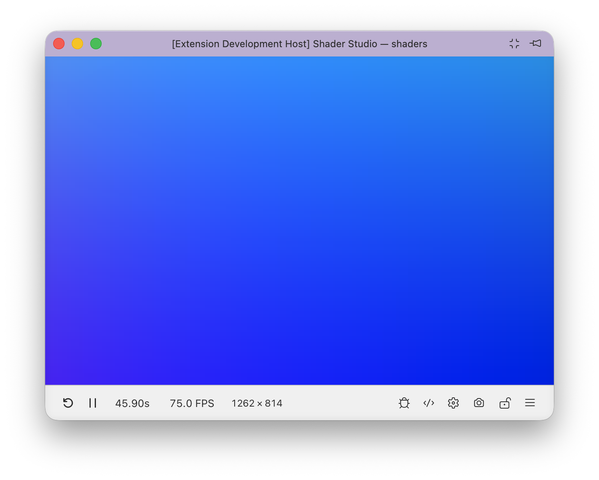

# Quick Start


## Step 1: Install

1. Open VS Code and go to the **Extensions** panel (`Cmd+Shift+X` / `Ctrl+Shift+X`).
2. Search for **Shader Studio** and click **Install**.

Or install directly from the [VS Code Marketplace](https://marketplace.visualstudio.com/items?itemName=teaqu.shader-studio).

## Step 2: Create a Shader

Open an existing `.glsl` file, or create a new one and write a `mainImage` function. If you want a head start, click the  **Shader Studio** icon in the status bar and choose **New Shader**, or open the Command Palette (`Cmd+Shift+P` / `Ctrl+Shift+P`) and run **Shader Studio: New Shader** to generate a template.

## Step 3: Write Your Shader

Shader Studio runs Shadertoy-style shaders. Your shader needs a `mainImage` function. If you created your shader with the **New Shader** button, you should see something like this:

```glsl
void mainImage( out vec4 fragColor, in vec2 fragCoord )
{
    // Normalized pixel coordinates (from 0 to 1)
    vec2 uv = fragCoord/iResolution.xy;

    // Time varying pixel color
    vec3 col = 0.5 + 0.5*cos(iTime+uv.xyx+vec3(0,2,4));

    // Output to screen
    fragColor = vec4(col,1.0);
}
```

!!! note "New to shaders or Shadertoy?"
    A shader is a small program that runs on your GPU. Instead of looping over pixels in code, the GPU runs `mainImage` **once per pixel, in parallel**, every frame.

    The code above breaks down like this:

    - `fragCoord` — the current pixel's position on screen in pixels
    - `iResolution` — the canvas size; dividing gives `uv`, a 0–1 position across the screen
    - `fragColor` — the color you output, as `vec4(red, green, blue, alpha)` where each channel is 0–1
    - `iTime` — seconds elapsed since the shader started, useful for animation

    Shader Studio also provides `iMouse` (mouse position) and other uniforms that match the [Shadertoy](https://www.shadertoy.com) API, so shaders from that site will generally work here too.

    [Watch this video by The Art of Code](https://www.youtube.com/watch?v=u5HAYVHsasc) for a good beginner's introduction.

## The Preview

Click the  **Shader Studio** icon in the status bar and choose **Open Panel** (or **Open Window** for a separate window) to see your shader running.

Once open, you should see a live preview — either as a panel docked inside VS Code or as a separate window.



The preview updates in real time as you edit. The toolbar at the bottom gives quick access to every feature:

- <i class="codicon codicon-debug-restart"></i> **Reset** — restart the shader and reset time-dependent state
- <i class="codicon codicon-play"></i> / <i class="codicon codicon-debug-pause"></i> [**Play/Pause**](features/time-controls.md) — freeze or resume animation
- [**Time**](features/time-controls.md) — scrub, loop, and control playback speed
- **FPS** — click to set frame rate limit or open [Frame Times](features/performance.md)
- [**Resolution**](features/resolution.md) — click to change scale, aspect ratio, zoom, or set a custom resolution
- <i class="codicon codicon-bug"></i> [**Debug**](workflows/debug-shaders.md) — enable line-by-line visual debugging
- <i class="codicon codicon-code"></i> [**Editor**](features/editor-overlay.md) — toggle inline code editing overlay
- <i class="codicon codicon-gear"></i> [**Config**](features/config-buffers.md) — set up buffers, inputs, and uniforms
- <i class="codicon codicon-device-camera"></i> [**Record**](features/recording.md) — take a screenshot or record video/GIF
- <i class="codicon codicon-lock"></i> [**Lock**](features/locking.md) — keep the preview pinned to the current shader while you navigate other files
- <i class="codicon codicon-menu"></i> **Menu** — access more options like shader explorer, snippet library, compile modes, browser preview, and settings

Try pausing time, changing the resolution, or opening the menu to explore more options and see their effects.

If you opened the preview as a panel, you can drag its tab to rearrange it alongside other Shader Studio panels (Debug, Config, Performance), split it to an edge, or resize by dragging the sash. The layout saves automatically.

See [Panel Layout](features/panel-layout.md) for more.

## Step 5: Make Changes

Edit your shader and watch the preview update in real time. By default, Shader Studio uses **Hot** compile mode — the shader recompiles on every keystroke.

If you prefer more control, open the **Menu** and change the [**Compile Mode**](features/compile-modes.md):

| Mode | When it compiles |
|------|-----------------|
| **Hot** | On every keystroke (default) |
| **Save** | Only when you save the file |
| **Manual** | Only when you press `Ctrl+Enter` or click **Compile Now** |

## Step 6: Setup Channels and Buffers

Click the <i class="codicon codicon-gear"></i> **Config** button in the toolbar to set up buffer passes, input channels, and uniforms for your shader. Configuration is stored in a `.sha.json` file (e.g. `myshader.glsl` → `myshader.sha.json`) that's generated automatically when needed.


_Example: a texture assigned to `iChannel0`, available in the shader as `sampler2D iChannel0`._

To add a texture, drop an image into your workspace, click the **+** on an empty channel slot, and select it from the file picker:


If the image was just added, you may need to click the reload button in the picker for it to appear. Press **Close** when done.

Once a texture is bound to `iChannel0`, you can sample it in your shader:

```glsl
void mainImage(out vec4 fragColor, in vec2 fragCoord) {
    vec2 uv = fragCoord / iResolution.xy;
    vec4 tex = texture(iChannel0, uv);
    fragColor = tex;
}
```

See [Configure Buffers and Inputs](features/config-buffers.md) for the full guide.

### <i class="codicon codicon-lock"></i> Keep the Shader Active While Editing Buffers

Locking is an **important** feature when working with multi-buffer shaders. Opening a buffer file will switch the preview to that buffer — use the <i class="codicon codicon-lock"></i> **Lock** button to keep the preview pinned to a specific shader while you navigate between buffer files to edit them.

See [Locking](features/locking.md) for more info.

## Next

- [Setup Channels and Buffers](features/config-buffers.md) — configure buffer passes, inputs, and uniforms
- [Debugging Overview](debugging/index.md) — learn how to use debug mode to visualize shader variables

